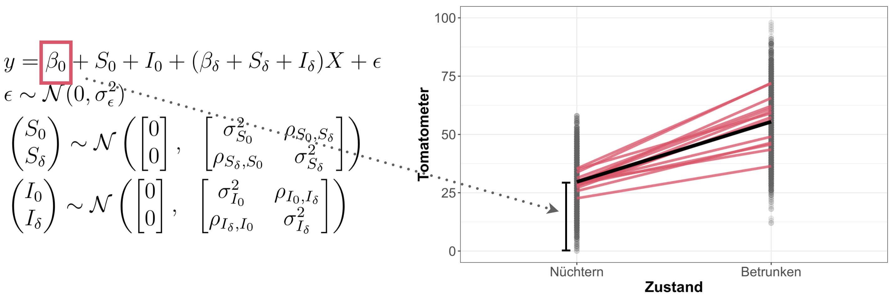

layout: true

<div class="my-footer">
  <span style="text-align:center">
    <span> 
      
    </span>
    <a href="https://therbootcamp.github.io/">
      <span style="padding-left:82px"> 
        <font color="#7E7E7E">
          www.therbootcamp.com
        </font>
      </span>
    </a>
    <a href="https://therbootcamp.github.io/">
      <font color="#7E7E7E">
       Statistik mit R | Oktober 2021
      </font>
    </a>
    </span>
  </div> 

---

```{r, eval = TRUE, echo = FALSE, warning=F,message=F}
# Code to knit slides

```

```{r setup, include=FALSE}
knitr::opts_chunk$set(warning = FALSE, message = FALSE)
options(htmltools.dir.version = FALSE)
# see: https://github.com/yihui/xaringan
# install.packages("xaringan")
# see: 
# https://github.com/yihui/xaringan/wiki
# https://github.com/gnab/remark/wiki/Markdown
options(width = 110)
options(digits = 4)

# Load packages
library(tidyverse)
library(lme4)
tomato_df <- read_csv("1_Data/Tomatometer.csv")
df <- read_csv("1_Data/MEM_example.csv")
grand_mean <- mean(df$tomatometer)

baselers <- read_csv("https://raw.githubusercontent.com/therbootcamp/baselers/master/inst/extdata/baselers.txt")
baselers <- baselers %>% 
  filter(!is.na(income),!is.na(age),!is.na(height)) %>%
  slice(sample(1:nrow(baselers),1000)) %>% 
  mutate(sex01 = as.numeric(sex == 'male'))
source("https://raw.githubusercontent.com/therbootcamp/oldpage/master/_materials/code/baselrbootcamp_palettes.R")
set.seed(102)
x <- rnorm(10)
y <- .7 * x + rnorm(10, sd = .3) + 2
data <- data.frame(x, y)
mod <- lm(y ~ x, data = data)

great_intercept <- mod$coefficients[1]
great_slope <- mod$coefficients[2]
dat_great <- data.frame(x0 = x, x1 = x,
                        y0 = y, y1 = great_intercept + great_slope * x)
great_raw <- ggplot(dat_great, aes(x = x0, y = y0)) + geom_point(col = baselrbootcamp_cols("grey"), size = 2) +
  geom_abline(slope = great_slope, intercept = great_intercept, size = .5, linetype = 3) +
  theme_minimal() + xlim(c(-2, 3)) + ylim(c(0, 5)) +
  labs(subtitle = paste("Or this?"), x = "Predictor", y = "Criterion")

great_err <- great_raw + 
  geom_linerange(data = dat_great, aes(x = x0, ymin = y0, ymax = y1), col = baselrbootcamp_cols("magenta")) +
  geom_point(data = dat_great, aes(x = x0, y = y1, size = 2), col = baselrbootcamp_cols("green"), pch = "X", size = 4) +
  labs(subtitle = paste("Mean Squared Error (MSE) = ", round(mean((dat_great$y1 - dat_great$y0) ^ 2), 2)),
       x = "Predictor", y = "Criterion")


b0_s1 <- 4
b0_s2 <- 2
b0_s3 <- 7

b1_s1 <- .8
b1_s2 <- .3
b1_s3 <- .4

x_s1 <- rep(c(5, 10, 15, 20, 25, 30), 30)
x_s2 <- rep(c(5, 10, 15, 20, 25, 30), 30)
x_s3 <- rep(c(5, 10, 15, 20, 25, 30), 30)

y_s1 <- b0_s1 + b1_s1 * x_s1 + rnorm(length(x_s1), 0, 5)
y_s2 <- b0_s2 + b1_s2 * x_s2 + rnorm(length(x_s2), 0, 5)
y_s3 <- b0_s3 + b1_s3 * x_s3 + rnorm(length(x_s3), 0, 5)

s_dat <- tibble(
  y = c(y_s1, y_s2, y_s3),
  x = c(x_s1, x_s2, x_s3),
  Site = rep(c("Zentrum 1", "Zentrum 2", "Zentrum 3"), each = length(x_s1))
)


```

# Ein Beispiel zur Datenerhebung

<br>

.pull-left45[

<p align = "center">
<br>
</p>

]

.pull-right45[

<p align = "center">
<br>
</p>

]

---


# [IID](https://de.wikipedia.org/wiki/Unabh%C3%A4ngig_und_identisch_verteilte_Zufallsvariablen) Annahme

.pull-left45[
Bisherige Regressionsmodelle machen die Annahme, dass die Residuen unabhängig und gleichverteilt sind (independent and identically distributed, <high>iid</high>).

<ul>
  <li class="m1"><span><high>Unabhängig</high>: Das Auftreten eines Wertes hat keinen Einfluss auf das Auftreten anderer Werte.</span></li>
  <li class="m2"><span><high>Gleichverteilt</high>: Alle Datenpunkte stammen aus derselben Wahrscheinlichkeitsverteilung.</span></li>
</ul>

Bisherige Modelle sind gegenüber der Verletzung der Unabhängigkeitsannahme <high>nicht robust</high>.


]

.pull-right45[


]

---

# Beispiele von Daten, bei denen die IID.-Annahme verletzt ist


.pull-left55[

<br>

<ul>
  <li class="m1"><span>Leistung von Schülern in der PISA Studie(<high>Schüler > Klassen > Schulen > Ländern</high>).</span></li>
  <li class="m2"><span>Multizentrische klinische Studie (<high>Patienten > Ärzte > Zentrum</high>).</span></li>
  <li class="m3"><span>Vergleich unterschiedlicher Designs oder Geschmäcker eines Produkts mit <high>mehreren Einschätzungen pro Person</high>.</span></li>
</ul>


**Wichtig**: *Verletzungen der IID-Annahme können zu irreführenden Resultaten führen, z.B. dem Unterschätzen des Standardfehlers.* 


]

.pull-right35[


<p align = "center">
<br>
<font style="font-size:10px">from <a href="https://de.wikipedia.org/wiki/PISA-Studien">wikipedia.org</a></font>
</p>

<p align = "center">
<br>
<font style="font-size:10px">from <a href="https://www.mssociety.org.uk/research/latest-research/latest-research-news-and-blogs/first-multi-drug-clinical-trial-in-ms-successfully-completed">mssociety.org.uk</a></font>
</p>

<p align = "center">
<br>
<font style="font-size:10px">from <a href="https://londonist.com/london/free-and-cheap/this-5-metre-high-pick-n-mix-wall-has-half-a-tonne-of-free-sweets">londonist.com</a></font>
</p>


]
---


# Beispiel - Multizentrische klinische Studie

.pull-left45[
<br>
Wir wollen die Effektivität unterschiedlicher Dosierungen eines Medikamentes evaluieren. Dazu haben wir Daten über drei Zentren.


So würden wir eine Regression über alle Zentren rechnen (aber ist dies eine gute Idee?):

```{r eval = FALSE}

mod <- lm(formula = Merkmal ~ Dosis,
          data = DATEN_ZENTREN)

```


]

.pull-right45[

<br>


<p align="center">
```{r, echo = FALSE, fig.width = 4.2, fig.height = 2.7, dpi = 400, out.width = "100%"}
ggplot(s_dat, aes(x, y)) + 
  geom_point(col = "#606061", alpha = .7) +
  geom_smooth(method = "lm", col = "#EA4B68", se = FALSE) +
  theme_classic() +
  labs(y = "Merkmal",
       x = "Dosis") +
  theme(
    strip.text = element_text(size = 12, face = "bold"),
    axis.text = element_blank(),
    axis.ticks = element_blank(),
    axis.title = element_text(size = 18,face = "bold"),
    axis.line = element_line(size = 1)
  )
```
</p>

]

---

# Beispiel - Multizentrische klinische Studie

.pull-left45[


Wir wollen die Effektivität unterschiedlicher Dosierungen eines Medikamentes evaluieren. Dazu haben wir Daten über drei Zentren.

So würden wir eine Regression pro Zentrum rechnen (aber ist dies eine gute Idee?):

```{r eval = FALSE}

mod_s1 <- lm(formula = Merkmal ~ Dosis,
             data = DATEN_ZENTRUM1)

mod_s2 <- lm(formula = Merkmal ~ Dosis,
             data = DATEN_ZENTRUM2)

mod_s3 <- lm(formula = Merkmal ~ Dosis,
             data = DATEN_ZENTRUM3)

```


]

.pull-right45[

<br>

<p align="center">
```{r, echo = FALSE, fig.width = 4.2, fig.height = 2.7, dpi = 400, out.width = "100%"}
s_dat %>% 
  rename(Zentrum = Site) %>% 
ggplot(aes(x, y, col = Zentrum)) + 
  geom_point(alpha = .7) +
  geom_smooth(method = "lm", se = FALSE) +
  theme_classic() +
  labs(y = "Merkmal",
       x = "Dosis") +
  theme(
    strip.text = element_text(size = 12, face = "bold"),
    axis.text = element_blank(),
    axis.ticks = element_blank(),
    axis.title = element_text(size = 18,face = "bold"),
    axis.line = element_line(size = 1)
  )

```
</p>

]


---

# Gemischtes Modell

.pull-left5[

Gemischte Modelle (mixed effects models) bieten eine bessere Möglichkeit Daten zu analysieren, welche die IID Annahme verletzen.

Gemischte Modelle kombinieren zwei Arten von Effekten, die unterschiedliche Zwecke erfüllen: 


<ul>
  <li class="m1"><span><high>Feste Effekte (fixed effects)</high>
  <br><br>
  <ul class="level">
    <li><span>Die Globaleffekte, welche wir quantifizieren möchten.</span></li>
  </ul>
  </span></li>
</ul>


<ul>
  <li class="m2"><span><high>Zufällige Effekte (random effects)</high>
  <br><br>
  <ul class="level">
    <li><span>Berücksichtigung der Abhängigkeiten in den Daten.</span></li>
    <li><span>Diejenigen Effekte, über welche wir generalisieren möchten.</span></li>
  </ul>
  </span></li>
</ul>

]

.pull-right45[

```{r eval = FALSE}
                      # feste Effekte
LMM <- lmer(formula = y ~ FE1 + FE2 + 
                      # zufällige Effekte
                      (FE1|RE) + (FE2|RE), 
            data = DATEN)
```

<p align="center">
```{r, echo = FALSE, fig.width = 4.2, fig.height = 2.7, dpi = 400, out.width = "100%", warning=FALSE}

tomato_df <- tomato_df %>%
  mutate(State = factor(zustand, levels = c("nuechtern", "betrunken")))

model1<-lmer(formula = tomatometer ~ State + (State|id) + (State|film), 
             data=tomato_df)

m_line <- fixef(model1)

# visualize model fit
fittednorms<-ranef(model1)$id[,1:2]
fittednorms[,1]<-fittednorms[,1]+getME(model1,"beta")[1]
fittednorms[,2]<-fittednorms[,2]+getME(model1,"beta")[2]
colnames(fittednorms)<-c("intercept","slope")

set.seed(25)
rand10<-sample(1:200, 15, replace = FALSE)

ggplot(tomato_df, aes(State, tomatometer))+
  geom_point(colour= "#606061", alpha = .15, size = 2.5)+
  # geom_segment(aes(x = 1, y = intercept,xend=2, yend=intercept+slope ),
  #              data=fittednorms,colour = "gray85", size = 1)+
  geom_segment(aes(x = 1, y = intercept,xend=2, yend=intercept+slope ),
               data=fittednorms[rand10,],colour = "#EA4B68", size = 1.5,
               alpha = .8)+
  geom_segment(aes(x = 1, y = m_line[1], xend = 2, yend = sum(m_line)),
               data=fittednorms[rand10,],colour = "black", size = 2,
               alpha = 1)+
  theme_classic() +
  labs(
    x = "",
    y = ""
  ) +
  theme(
    strip.text = element_text(size = 12, face = "bold"),
    axis.text = element_blank(),
    axis.ticks = element_blank(),
    axis.title = element_text(size = 18,face = "bold"),
    axis.line = element_line(size = 1.1)
  )

```
</p>

]

---

# Feste Effekte

.pull-left5[

<br>
Feste Effekte repräsentieren dieselben Gruppeneffekte wie bei den bisherigen Regressionsmodellen; zum Beispiel den Effekt eines Medikamentes auf ein relevantes Merkmal.

Bis jetzt haben wir ausschliesslich Modelle mit festen Effekten betrachtet.


```{r eval = FALSE}

mod <- lm(formula = Merkmal ~ Dosis,
          data = DATEN_ZENTREN)

```


]

.pull-right45[

<br>

<p align="center">
```{r, echo = FALSE, fig.width = 4.2, fig.height = 2.7, dpi = 400, out.width = "100%"}
ggplot(s_dat, aes(x, y)) + 
  geom_point(col = "#606061", alpha = .7) +
  geom_smooth(method = "lm", col = "#EA4B68", se = FALSE) +
  theme_classic() +
  labs(y = "Merkmal",
       x = "Dosis") +
  theme(
    strip.text = element_text(size = 12, face = "bold"),
    axis.text = element_blank(),
    axis.ticks = element_blank(),
    axis.title = element_text(size = 18,face = "bold"),
    axis.line = element_line(size = 1)
  )
```
</p>

]

---

# Beispieldaten

.pull-left45[

Wir möchten den Einfluss von Alkoholkonsum auf Filmrezensionen auf [Rotten Tomatoes](https://www.rottentomatoes.com/) untersuchen.

Wir rekrutieren zwei Versuchspersonen, die je zwei Filme beurteilen, und zwar einmal im nüchternen Zustand und einmal nachdem sie 4 kleine Biere getrunken haben.

<ul>
  <li class="m1"><span>Wiederholte Messung (<i>within subjects design</i>).</span></li>
  <li class="m2"><span>Dieselben Filme an beiden Zeitpunkten für beide VPs.</span></li>
</ul>


]

.pull-right45[


]


---


# Modell mit ausschliesslich festen Effekten


---

# Zufällige Effekte

.pull-left45[
Kontrollieren für Quellen, die Abhängigkeiten in den Daten verursachen können, unter der Annahme, dass aus diesen Quellen zufällig gezogen wird. Dabei sind wir nicht direkt an den konkreten Werten der zufälligen Effekte interessiert.


Zufällige Effekte:

<ul>
  <li class="m1"><span>Sind häufig der Teil, über welchen wir generalisieren möchten.</span></li>
  <li class="m2"><span>Sind immer kategoriale Variablen (<high>factors</high>).</span></li>
  <li class="m3"><span>Repräsentieren zufällige Ziehungen aus der Population.</span></li>
</ul>


]

.pull-right45[


]


---

# Zufällige Effekte

.pull-left45[
Kontrollieren für Quellen, die Abhängigkeiten in den Daten verursachen können, unter der Annahme, dass aus diesen Quellen zufällig gezogen wird. Dabei sind wir nicht direkt an den konkreten Werten der zufälligen Effekte interessiert.


><i>Durch das Spezifizieren zufälliger Effekte in unserem Modell sind wir in der Lage, die Eigenheiten unserer Stichprobe auszublenden und eine allgemeinere Schätzung der festen Effekte zu erhalten.</i>
<font style="font-size:10px"><a href="http://davidkellen.org/wp-content/uploads/2017/04/introduction-mixed-models.pdf">Singmann & Kellen, 2017


]

.pull-right45[


]

---

# Zufällige Effekte - Intercepts und Slopes

.pull-left45[

Wir unterscheiden zwischen zwei Arten zufälliger Effekte:


<ul>
  <li class="m1"><span><high>Random Intercepts</high>
  <br><br>
  <ul class="level">
    <li><span>Geschätzte durchschnittliche Abweichung jedes Faktorlevels des zufälligen Effekts vom Intercept des festen Effekts.</span></li>
  </ul>
  </span></li>
</ul>

<ul>
  <li class="m2"><span><high>Random Slopes</high>
  <br><br>
  <ul class="level">
    <li><span>Geschätzte Abweichung jedes Faktorlevels des zufälligen Effektes vom Slope des festen Effekts.</span></li>
  </ul>
  </span></li>
</ul>


]

.pull-right45[


]


---

# Modell mit Random Intercepts 

.pull-left45[


<p align = "center">
<figcaption align = "center" style="display: block; margin: auto;">Random Intercepts über Probanden</figcaption>
</p>


]

.pull-right45[


<p align = "center">
<figcaption align = "center" style="display: block; margin: auto;">Random Intercepts über Filme</figcaption>
</p>

]


---

# Modell mit Random Intercepts und Random Slopes

.pull-left45[


<p align = "center">
<figcaption align = "center" style="display: block; margin: auto;">Random Intercepts und Slopes über Probanden</figcaption>
</p>


]

.pull-right45[


<p align = "center">
<figcaption align = "center" style="display: block; margin: auto;">Random Intercepts und Slopes über Filme</figcaption>
</p>


]


---

# Modell mit gekreuzten zufälligen Effekten


---

# Regressionsgleichung des gemischten Modells

<br><br><br>


---

# Regressionsgleichung des gemischten Modells

<br><br><br>


---

# Regressionsgleichung des gemischten Modells

<br><br><br>


---

# Regressionsgleichung des gemischten Modells

<br><br><br>


---

# Regressionsgleichung des gemischten Modells

<br><br><br>


---

# Regressionsgleichung des gemischten Modells

<br><br><br>


---

# Regressionsgleichung des gemischten Modells

<br><br><br>


---

# Regressionsgleichung des gemischten Modells

<br><br><br>


---

# Gekreuzte vs. Hierarchische Zufällige Effekte
<br>
.pull-left35[

<p align = "center">
<figcaption align = "center" style="display: block; margin: auto;">Crossed Random Effects</figcaption>
</p>

<br><br>

**Gekreuzte zufällige Effekte:** Alle Modellstrukuren mit multiplen zufälligen Effekten, welche nicht geschachtelt sind.

]

.pull-right55[


<p align = "center">
<figcaption align = "center" style="display: block; margin: auto;">Nested Random Effects</figcaption>
</p>

<br><br>

**Hierarchische zufällige Effekte:** Jedes Level eines untergeordneten Faktors erscheint in nur einem level des übergeordneten Faktors (geschachtelte Ebenen).

]


---

# Auswahl der Struktur der zufälligen Effekte

.pull-left45[

Es ist wichtig, die korrekte Struktur der zufälligen Effekte festzulegen. Ansonsten kann es zu einer $\alpha$-Fehler-Inflation oder einer Power-Deflation kommen.

Es wurde argumentiert, dass man die <high>maximale Struktur der zufälligen Effekte spezifizieren sollte, die durch das Design gerechtfertigt ist (*maximal model*; [Barr et al., 2014](https://www.ncbi.nlm.nih.gov/pmc/articles/PMC3881361/pdf/nihms533954.pdf)).

Dies kann jedoch zu konservativ sein, wenn die maximale Struktur nicht in den Daten vorhanden ist. Ein Kompromiss findet sich in der Durchführung eines <high>Rückwärtsauswahlverfahrens</high> (siehe [Matuschek, Kliegl, Vasishth, Baayen, & Bates, 2017](https://www.sciencedirect.com/science/article/pii/S0749596X17300013)).

]

.pull-right45[

<br>

<p align = "center">
<br>
<font style="font-size:10px">from <a href="https://www.shutterstock.com/de/search/maximum.+minimum.?studio=1">shutterstock.com</a></font>
</p>


]


---

# Gemischte Modelle in R

.pull-left45[

<br>

Auswahl an Paketen zur Berechnung gemischter Modelle:

| Package| Function|
|:------|:----|
| [lme4](https://CRAN.R-project.org/package=lme4)| `glmer()`, `lmer()`|
| [afex](https://CRAN.R-project.org/package=afex)| `mixed()`|
| [rstanarm](https://CRAN.R-project.org/package=rstanarm)| `stan_glmer()`,  `stan_lmer()` |
| [brms](https://CRAN.R-project.org/package=brms)| `brm()`|


]

.pull-right5[

<br>

```{r eval = FALSE}
# Gemischtes Modell mit lme4::lmer()

# feste Effekte
LMM_out <- lmer(formula = Reaction ~ Days +
# Random Intercepts und Slopes für ID
                  (Days|Subject),
# Daten
                 data = sleepstudy)

# Output
summary(LMM_out)
```


]

---

# Zufällige Effekte in <high>lme4</high>


Zufällige Effekte werden mit einem neuen Element in den Formeln spezifiziert:


| Formel | Bedeutung |
|:----------|:-------------------|
| `(1 `&#124;` S)` | Random intercepts über `S` |
| `(1 `&#124;` S) + (1 `&#124;` I)` | Random intercepts über `S` und `I`|
| `(X1 `&#124;` S)` OR `(1 + X1`&#124;` S)`| Random intercepts über `S` und random slopes für `X1` über `S` mit Korrelationen  |
| `(X1 * X2 `&#124;` S)`| Random intercepts über `S` and random slopes für `X1`, `X2`, and deren Interaktion `X1:X2` über `S` mit Korrelationen  |
| `(0 + X1 `&#124;` S)`| Random slopes für `X1` über `S`, keine random intercepts |
| `(X1 `&#124;&#124;` S)`| Random intercepts über `S` und random slopes für `X1` über `S` keine Korrelationen |
| `(1 `&#124;` S/C)` OR `(1 `&#124;` S) + (1 `&#124;` S:C)`| Random intercepts über `S` und `C` mit `C` geschachtelt unter `S` |

---

# Gemischte Modelle in R - Ein Beispiel

.pull-left45[

<br>

Wir wollen das <high>tomatometer</high> Rating vorhersagen, mit <high>zustand</high> als festen Effekt und mit random intercepts und random slopes über Rater (<high>id</high>), sowie random intercepts und random slopes über Item (<high>film</high>). 


<p align = "center">
<br>
<font style="font-size:10px">from <a href="https://www.rottentomatoes.com/m/interstellar_2014">rottentomatoes.com</a></font>
</p>


]

.pull-right5[

<br>

*Was denkt ihr ist die korrekte Modellspezifikation?*

```{r eval = FALSE}
# Gemischtes Modell mit lme4::lmer()

# Feste Effekte
LMM <- XXX(formula = XXX ~ XXX +
# Random intercepts und slopes über id
                  (XXX) +
# Random intercepts und slopes über film
                  (XXX),
# Daten
                data = tomato)

# Output
summary(LMM)
```

]


---

# Gemischte Modelle in R - Ein Beispiel

.pull-left45[

<br>

Wir wollen das <high>tomatometer</high> Rating vorhersagen, mit <high>zustand</high> als festen Effekt und mit random intercepts und random slopes über Rater (<high>id</high>), sowie random intercepts und random slopes über Item (<high>film</high>). 

<p align = "center">
<br>
<font style="font-size:10px">from <a href="https://www.rottentomatoes.com/m/interstellar_2014">rottentomatoes.com</a></font>
</p>

]

.pull-right5[

<br>

*So können wir das Modell in R spezifizieren:*

```{r eval = FALSE}
# Gemischtes Modell mit lme4::lmer()

# Feste Effekte
LMM <- lmer(formula = tomatometer ~ zustand +
# Random intercepts und slopes über id
                  (zustand|id) +
# Random intercepts und slopes über film
                  (zustand|film),
# Daten
                data = tomato)

# Output
summary(LMM)
```


]


---

# `lmer()` Output


---

class: middle, center

<h1><a href="https://therbootcamp.github.io/SmR_2021Oct/_sessions/GemischteModelle/GemischteModelle_practical.html">Practical</a></h1>

