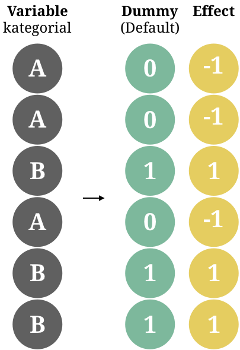
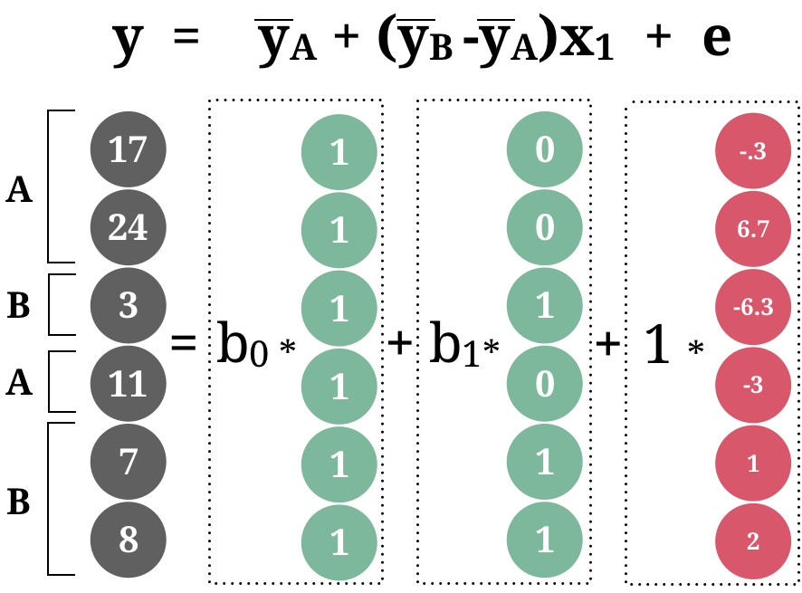
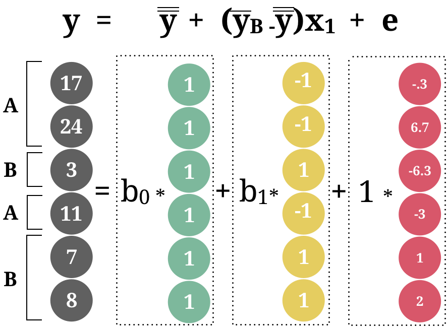
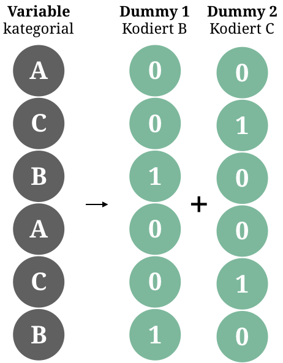

---

```{r, eval = TRUE, echo = FALSE, warning=F,message=F}
# Code to knit slides

```

```{r setup, include=FALSE}
options(htmltools.dir.version = FALSE)
options(width = 110)
options(digits = 4)

# Load packages
require(tidyverse)

print2 <- function(x, nlines=10,...) {
   cat(head(capture.output(print(x,...)), nlines), sep="\n")}

# Load data
baselers <- readr::read_csv("1_Data/baselers.csv")

# get color palette functions
source("../../_materials/palette/therbootcamp_palettes.R")
colors = baselrbootcamp_colors

knitr::opts_chunk$set(dpi = 300, echo = FALSE, warning = FALSE, fig.align = 'center', message= FALSE)

```

# Allgemeines lineares Modell

.pull-left4[

<ul>
  <li class="m1"><span>Das allgemeine lineare Modell ist das schweizer Taschenmesser der Statistik.</span></li>
  <li class="m2"><span>Schliesst ein:</span></li>
  <ul class="level">
    <li><span><high>Regression</high></li></span>
    <li><span><high>t-Test<high></li></span>
    <li><span><high>Varianzanalyse (ANOVA)</high></li></span>
    <li><span>Mediationsanalyse</li></span>
    <li><span>Faktorenanalyse</li></span>
    <li><span>Strukturgleichungsmodelle</li></span>
  </ul>
</ul>

]

.pull-right5[

<p align="center">


</p>
]

---

# Kategoriale Variablen

.pull-left4[

<ul>
  <li class="m1"><span>Das allgemeine Lineare Modell kann auch mit <high>kategorialen Prädiktoren</high> umgehen.</span></li>
  <li class="m2"><span>Neben <high>dedizierten Tests</high> (z.B., <mono>t.test()</mono>), können solche Prädiktoren ebenfalls in <mono>lm()</mono> aufgenommen werden.</span></li>
  <li class="m3"><span>Beispiele</span></li>
  <ul class="level">
    <li><span><high>Gruppenvergleiche</high></li></span>
    <li><span><high>A/B Tests<high></li></span>
  </ul>
</ul>

]

.pull-right5[

```{r, echo = F, fig.width = 3.5, fig.height = 3}

library(tidyverse) ; library(ggrepel)

# Lade Tourismus Daten
tour <- read_csv('1_Data/Tourismus.csv') 
europa <- read_csv('1_Data/Europa.csv') 

# Berechne Nächte per Region
tour = tour %>%
  mutate(Nächte = Besucher * Dauer) %>%
  left_join(europa) %>% 
  mutate(Nächte_log = log2(Nächte),
         Region = stringr::str_trunc(Region, 7, ellipsis = "."))

tour %>%  filter(Region %in% c('Europa','Asien')) %>% 
  ggplot(aes(x = Region, 
             y = Nächte)) +
  scale_y_continuous(trans = 'log2') + 
  geom_boxplot() +
  theme_minimal() 

```

]

---

# `t.test()`

.pull-left4[
<ul>
  <li class="m1"><span>Der t-Test <high>vergleicht zwei Gruppen</high> in einer kontinuierlichen Variable.</span></li>
  <li class="m2"><span>Die Nullhypothese ist, dass die Gruppen einen <high>identischen Mittelwert</high> besitzen.</span></li>
  <li class="m3"><span>Beispiele</span></li>
  <ul class="level">
    <li><span><high>Gruppenvergleiche</high></li></span>
    <li><span><high>A/B Tests<high></li></span>
  </ul>
</ul>
]


.pull-right5[

```{r, echo = T, fig.width = 3.5, fig.height = 3}

t.test(tour$Nächte_log[tour$Region == 'Europa'],
       tour$Nächte_log[tour$Region == 'Asien'])
```


]

---

# `lm()`

.pull-left4[
<ul>
  <li class="m1"><span>Der t-Test <high>vergleicht zwei Gruppen</high> in einer kontinuierlichen Variable.</span></li>
  <li class="m2"><span>Die Nullhypothese ist, dass die Gruppen einen <high>identischen Mittelwert</high> besitzen.</span></li>
  <li class="m3"><span>Beispiele</span></li>
  <ul class="level">
    <li><span><high>Gruppenvergleiche</high></li></span>
    <li><span><high>A/B Tests<high></li></span>
  </ul>
</ul>
]


.pull-right5[

```{r, echo = T, fig.width = 3.5, fig.height = 3}
lm(Nächte_log ~ Region, 
   tour %>% 
     filter(Region %in% c('Europa', 'Asien')))
```

]


---

# Kodierung

.pull-left4[

<ul>
  <li class="m1"><span>Kategoriale Variablen müssen für die Regression in  <high>k-1 neue Variablen kodiert werden</high>.</span></li>
  <li class="m2"><span>Zwei Kodierungsarten:</span></li>
  <ul>
    <li><span><high>Dummy coding</high> setzt Werte einer Kategorie auf 1, anonsten 0<br>&rarr; <high>intercept = 0-Kategorie</high></span></li><br>
    <li><span><high>Effect coding</high> setzt Werte einer Kategorie auf 1, anonsten -1<br>&rarr; <high>Intercept  =  &#563;  </high></span></li>
  </ul>
</ul>

]

.pull-right5[

<p align="center">



</p>
]

---

# Designmatrix

.pull-left4[

<ul>
  <li class="m1"><span>Kategoriale Variablen müssen für die Regression in  <high>k-1 neue Variablen kodiert werden</high>.</span></li>
  <li class="m2"><span>Zwei Kodierungsarten:</span></li>
  <ul>
    <li><span><high>Dummy coding</high> setzt Werte einer Kategorie auf 1, anonsten 0<br>&rarr; <high>intercept = 0-Kategorie</high></span></li><br>
    <li><span><high>Effect coding</high> setzt Werte einer Kategorie auf 1, anonsten -1<br>&rarr; <high>Intercept  = &#563;</high></span></li>
  </ul>
</ul>

]

.pull-right5[

<p align="center">


</p>
]


---

# Designmatrix

.pull-left4[

<ul>
  <li class="m1"><span>Kategoriale Variablen müssen für die Regression in  <high>k-1 neue Variablen kodiert werden</high>.</span></li>
  <li class="m2"><span>Zwei Kodierungsarten:</span></li>
  <ul>
    <li><span><high>Dummy coding</high> setzt Werte einer Kategorie auf 1, anonsten 0<br>&rarr; <high>intercept = 0-Kategorie</high></span></li><br>
    <li><span><high>Effect coding</high> setzt Werte einer Kategorie auf 1, anonsten -1<br>&rarr; <high>Intercept  = &#563;</high></span></li>
  </ul>
</ul>

]

.pull-right5[

<p align="center">



</p>
]

---

# Designmatrix

.pull-left4[

<ul>
  <li class="m1"><span>Kategoriale Variablen müssen für die Regression in  <high>k-1 neue Variablen kodiert werden</high>.</span></li>
  <li class="m2"><span>Zwei Kodierungsarten:</span></li>
  <ul>
    <li><span><high>Dummy coding</high> setzt Werte einer Kategorie auf 1, anonsten 0<br>&rarr; <high>intercept = 0-Kategorie</high></span></li><br>
    <li><span><high>Effect coding</high> setzt Werte einer Kategorie auf 1, anonsten -1<br>&rarr; <high>Intercept  = &#563;</high></span></li>
  </ul>
</ul>

]

.pull-right5[

<p align="center">



</p>
]


---

# t-Test - drei Arten

.pull-left4[
<ul>
  <li class="m1"><span>Der t-Test <high>vergleicht zwei Gruppen</high> in einer kontinuierlichen Variable.</span></li>
  <li class="m2"><span>Die Nullhypothese ist, dass die Gruppen einen <high>identischen Mittelwert</high> besitzen.</span></li>
  <li class="m3"><span>Beispiele</span></li>
  <ul class="level">
    <li><span><high>Gruppenvergleiche</high></li></span>
    <li><span><high>A/B Tests<high></li></span>
  </ul>
</ul>
]


.pull-right5[

```{r, echo = T, fig.width = 3.5, fig.height = 3}
# Regulärer t-test
t_test <- 
t.test(tour$Nächte_log[tour$Region == 'Europa'],
       tour$Nächte_log[tour$Region == 'Asien'],
       var.equal = TRUE)

# Regression mit dummy
lm_dummy <- lm(
  Nächte_log ~ Region, 
  tour %>% 
    filter(Region %in% c('Europa', 'Asien')))

# Regression mit effect
lm_effect <- lm(
  Nächte_log ~ Region, 
  tour %>% 
    filter(Region %in% c('Europa', 'Asien')),
  contrasts = list(Region = contr.sum))
```

]


---

# t-Test - drei Arten

.pull-left4[
<ul>
  <li class="m1"><span>Der t-Test <high>vergleicht zwei Gruppen</high> in einer kontinuierlichen Variable.</span></li>
  <li class="m2"><span>Die Nullhypothese ist, dass die Gruppen einen <high>identischen Mittelwert</high> besitzen.</span></li>
  <li class="m3"><span>Beispiele</span></li>
  <ul class="level">
    <li><span><high>Gruppenvergleiche</high></li></span>
    <li><span><high>A/B Tests<high></li></span>
  </ul>
</ul>
]


.pull-right5[

```{r, echo = T, fig.width = 3.5, fig.height = 3}
t_test[c('statistic','parameter','p.value')]        %>% unlist

summary(lm_dummy)$coef

summary(lm_effect)$coef
```

]

---

# Multiple Kategorien

.pull-left4[
<ul>
  <li class="m1"><span>Bei mehr als zwei Kategorien, werden <high><mono>k - 1</mono> Dummyvariablen</high> erstellt.</span></li>
  <li class="m2"><span>Anonsten ändert sich nichts.</span></li>
</ul>
]

.pull-right5[
```{r, echo = F, fig.width = 3.5, fig.height = 3}

tour %>%
  ggplot(aes(x = Region, 
             y = Nächte)) +
  scale_y_continuous(trans = 'log2') + 
  geom_boxplot() +
  theme_minimal() +
  theme(axis.text.x = element_text(angle = 45, hjust = 1))

```
]


---

# Multiple Kategorien

.pull-left4[
<ul>
  <li class="m1"><span>Bei mehr als zwei Kategorien, werden <high><mono>k - 1</mono> Dummyvariablen</high> erstellt.</span></li>
  <li class="m2"><span>Anonsten ändert sich nichts.</span></li>
</ul>
]

.pull-right5[

<p align="center">



</p>
]


---

# `lm()`

.pull-left35[
<ul>
  <li class="m1"><span>Bei mehr als zwei Kategorien, werden <high><mono>k - 1</mono> Dummyvariablen</high> erstellt.</span></li>
  <li class="m2"><span>Anonsten ändert sich nichts.</span></li>
</ul>
]


.pull-right55[

```{r}
options(width=55)
```

```{r, echo = T, fig.width = 3.5, fig.height = 3}
# Regression mit allen Regionen
lm(Nächte_log ~ Region, 
   tour)
```

]


---

# `lm()`

.pull-left35[
<ul>
  <li class="m1"><span>Bei mehr als zwei Kategorien, werden <high><mono>k - 1</mono> Dummyvariablen</high> erstellt.</span></li>
  <li class="m2"><span>Anonsten ändert sich nichts.</span></li>
</ul>
]


.pull-right55[

```{r, echo = T, fig.width = 3.5, fig.height = 3}
# Regression mit allen Regionen
mod <- lm(Nächte_log ~ Region, 
          tour)

# Regressionstests
summary(mod)$coef
```

]

---

# `anova()`

.pull-left35[
<ul>
  <li class="m1"><span>Varianzanalyse (ANOVA) ist eine Verallgemeinerung des t-Tests und kann ebenfalls als ein <high>Spezialfall der Regression</high> verstanden werden.</span></li>
  <li class="m2"><span>Die Nullhypothese ist, dass alle Gruppen einen <high>identischen Mittelwert</high> besitzen.</span></li>
</ul>
]


.pull-right55[

```{r, echo = T, fig.width = 3.5, fig.height = 3}
# Regression mit allen Regionen
mod <- lm(Nächte_log ~ Region, 
   tour)

# ANOVA tests
anova(mod)
```

]


---

# Post-hoc 

.pull-left35[
<ul>
  <li class="m1"><span>Identifiziert nach einer ANOVA  <high>paarweise Gruppenunterschiede</high>.</span></li>
  <li class="m2"><span>Kontrolliert für das <high>Problem des multiplen Testens</high></span></li>
  </ul>
</ul>

<br>

$$q = \frac{\bar{y}_{max}-\bar{y}_{min}}{SE}$$
]

.pull-right55[

```{r, echo = T, fig.width = 3.5, fig.height = 3,message(mosaic)}
# Post-hoc mit Tukey
library(mosaic)
TukeyHSD(mod)$Region
```

]

---

# Interaktionen

.pull-left35[
<ul>
  <li class="m1"><span>Interaktionen modellieren <high>Moderationseffekte</high>.</span></li>
  <li class="m2"><span>Moderation: Effekt einer Variable wird durch eine andere Variable moderiert.</span></li>
</ul>
]


.pull-right5[

```{r, echo = FALSE, fig.width = 3.5, fig.height = 3}

library(tidyverse) ; library(ggrepel)

# Berechne Nächte per Region
d = read_csv('1_Data/Tourismus.csv') %>%
  mutate(Nächte = Besucher * Dauer) %>%
  left_join(read_csv('1_Data/Europa.csv')) %>% 
  filter(!is.na(Äquivalenzeinkommen)) %>% 
  mutate(Nächte_log = log2(Nächte))

m = lm(Nächte_log ~ Äquivalenzeinkommen + Bevölkerung, data = d %>% mutate(Nächte_log = log2(Nächte)))

res <- 1000

#Setup Axis
x <- seq(min(d$Äquivalenzeinkommen), max(d$Äquivalenzeinkommen), by = res)
y <- seq(min(d$Bevölkerung), max(d$Bevölkerung), by = res)

#Sample points
surface <- expand.grid(Äquivalenzeinkommen = x,
                       Bevölkerung = y, 
                       KEEP.OUT.ATTRS = F)
surface$Nächte_log2 <- predict.lm(m, newdata = surface)
surface <- reshape2::acast(surface, Bevölkerung ~ Äquivalenzeinkommen, value.var = "Nächte_log2")

require(plotly)
plt = plot_ly(d %>% mutate(Nächte_log = log2(Nächte)), 
        x = ~Äquivalenzeinkommen, 
        y = ~Bevölkerung, 
        z = ~Nächte_log,
        type = "scatter3d",
        width = 500, height = 420)

plt = add_trace(p = plt,
          z = surface,
          x = x,
          y = y,
          type = "surface",
        showscale=FALSE) 
plt %>%  layout(showlegend = FALSE)
   

```

]

---

# Interaktionen

.pull-left35[
<ul>
  <li class="m1"><span>Interaktionen modellieren <high>Moderationseffekte</high>.</span></li>
  <li class="m2"><span>Moderation: Effekt einer Variable wird durch eine andere Variable moderiert.</span></li>
</ul>
]


.pull-right55[

```{r, echo = T, eval = F, fig.width = 3.5, fig.height = 3}
# Regression mit Interaktion
mod <- 
  lm(Nächte_log ~ Äquivalenzeinkommen * Bevölkerung, 
     tour)

# Regressionstests
summary(mod)$coef
```

```{r, echo = F, fig.width = 3.5, fig.height = 3}
# Regression mit Interaktion
mod <- 
  lm(Nächte_log ~ Äq.Eink. +
                  Bevölk. + 
                  Äq.Eink.:Bevölk. , 
   tour %>% rename(Äq.Eink. = Äquivalenzeinkommen,
                          Bevölk. = Bevölkerung))

# Regressionstests
round(summary(mod)$coef,6)
```


]

---

# Interaktionen

.pull-left35[
<ul>
  <li class="m1"><span>Interaktionen modellieren <high>Moderationseffekte</high>.</span></li>
  <li class="m2"><span>Moderation: Effekt einer Variable wird durch eine andere Variable moderiert.</span></li>
</ul>
]


.pull-right55[

```{r, echo = T, eval=FALSE, fig.width = 3.5, fig.height = 3}
# Regression mit Interaktion
mod <- 
  lm(Nächte_log ~ Äquivalenzeinkommen +
                  Bevölkerung + 
                  Äquivalenzeinkommen:Bevölkerung, 
     tour)

# Regressionstests
summary(mod)$coef
```

```{r, echo = F, fig.width = 3.5, fig.height = 3}
# Regression mit Interaktion
mod <- 
  lm(Nächte_log ~ Äq.Eink. +
                  Bevölk. + 
                  Äq.Eink.:Bevölk. , 
     tour %>% rename(Äq.Eink. = Äquivalenzeinkommen,
                     Bevölk. = Bevölkerung))

# Regressionstests
round(summary(mod)$coef,6)
```


]

---

# z-Standardisierung

.pull-left35[
<ul>
  <li class="m1"><span>z-Standardisierung, d.h., <high>zentrieren und standardisieren</high>, fördert Interpretatierbarkeit.</span></li>
  <li class="m2"><span>Standardisierung</span></li>
  <ul class="level">
    <li><span>Standardabweichung = 1</span></li>
    <li><span>Schafft <high>Vergleichbarkeit der Effekte</high></li></span>
  </ul>
  <li class="m3"><span>Zentrieren</span></li>
  <ul class="level">
    <li><span>Mittelwert = 0</span></li>
    <li><span>Schafft <high>Unabhängigkeit der Interaktionseffekte</high></li></span>
  </ul>
</ul>

<br>

$$z(x) = \frac{x - \bar{x}}{s}$$
]


.pull-right55[

```{r, echo = T, eval=F, fig.width = 3.5, fig.height = 3}
# Regression mit allen Regionen
mod <- 
  lm(Nächte_log ~ Äquivalenzeinkommen * Bevölkerung, 
     tour %>% mutate_if(is.numeric, scale))

# Regressionstests
summary(mod)$coef
```


```{r, echo = F, fig.width = 3.5, fig.height = 3}
# Regression mit Interaktion
mod <- 
  lm(Nächte_log ~ Äq.Eink. +
                  Bevölk. + 
                  Äq.Eink.:Bevölk. , 
   tour %>% 
     rename(Äq.Eink. = Äquivalenzeinkommen,
                          Bevölk. = Bevölkerung) %>% 
     mutate_if(is.numeric, scale)
     )

# Regressionstests
round(summary(mod)$coef,6)
```


]

---

class: middle, center

<h1><a href="https://therbootcamp.github.io/SmR_2022Apr/_sessions/LinearModelsII/LinearModelsII_practical.html">Practical</a></h1>


