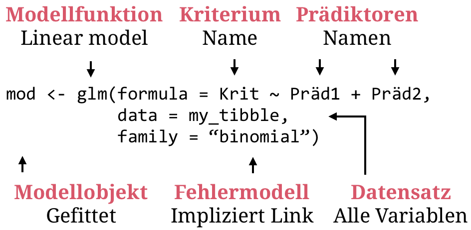

---

```{r, eval = TRUE, echo = FALSE, warning=F,message=F}
# Code to knit slides

```

```{r setup, include=FALSE}
options(htmltools.dir.version = FALSE)
options(width = 110)
options(digits = 4)

# Load packages
require(tidyverse)
require(MASS)

print2 <- function(x, nlines=10,...) {
   cat(head(capture.output(print(x,...)), nlines), sep="\n")}

# Load data
baselers <- readr::read_csv("1_Data/baselers.csv")

# get color palette functions
source("../../_materials/palette/therbootcamp_palettes.R")
colors = baselrbootcamp_colors

knitr::opts_chunk$set(dpi = 300, echo = FALSE, warning = FALSE, fig.align = 'center', message= FALSE)

```


# Generalisiertes lineares Modell

.pull-left4[

<ul>
  <li class="m1"><span>Das generalisierte lineare Modell ist <high>das eigentliche schweizer Taschenmesser</high> der Statistik.</span></li>
  <li class="m2"><span>Ermöglicht gegenüber dem allgemeinen Linearen Modell <high>verschiedene Datenmodelle und Link-Funktionen</high></span></li>
</ul>

]

.pull-right5[

<p align="center">


</p>
]

---

# Datenmodell

.pull-left4[

<ul>
  <li class="m1"><span>Gemäss dem Datenmodell der <high>Normalen Linearen Regression</high> folgen die Kriteriumswerte einer Normalverteilung um den vorhergesagten Wert</span></li>
  </ul>
</ul>

<br>

$$\Large y \sim \mathcal{N}(\hat{y}, \sigma_e)$$
<br>

$$\large p(x|\mu, \sigma) = \frac{1}{\sigma \sqrt 2\pi}e^{-(x-\mu)/2\sigma^2}$$

]

.pull-right5[

```{r, echo = FALSE, fig.width = 3.5, fig.height = 3}

library(tidyverse) ; library(ggrepel)

# Lade Tourismus Daten
tour <- read_csv('1_Data/Tourismus.csv') 
europa <- read_csv('1_Data/Europa.csv') 

# Berechne Nächte per Region
d = tour %>%
  mutate(Nächte = Besucher * Dauer) %>%
  left_join(europa) %>% 
  filter(!is.na(Äquivalenzeinkommen)) %>% 
  mutate(Nächte_log2 = log2(Nächte))

m = lm(Nächte_log2~ Äquivalenzeinkommen, data = d)

norm = dnorm(seq(4,14,.1),predict(m)[2], sd(resid(m))) * 10000
norm = norm - min(norm)
tbl1 = tibble(
       x = c(d$Äquivalenzeinkommen[2], d$Äquivalenzeinkommen[2]+norm, d$Äquivalenzeinkommen[2], d$Äquivalenzeinkommen[2]), 
       y = c(4, seq(4,14,.1), 14, 4))

norm = dnorm(seq(4,14,.1),predict(m)[7], sd(resid(m))) * 10000
norm = norm - min(norm)
tbl2 = tibble(
       x = c(d$Äquivalenzeinkommen[7], d$Äquivalenzeinkommen[7]+norm, d$Äquivalenzeinkommen[7], d$Äquivalenzeinkommen[7]), 
       y = c(4, seq(4,14,.1), 14, 4))

ggplot(d, 
       aes(x = Äquivalenzeinkommen, 
           y = Nächte_log2)) +
  geom_segment(
    aes(x = Äquivalenzeinkommen, xend = Äquivalenzeinkommen,
        y = predict(m), yend = Nächte_log2), linetype=3) +
  geom_polygon(data = tbl1, mapping = aes(x = x, y = y),size=1.3,fill=rgb(0,0,0,alpha=.3)) + 
  geom_polygon(data = tbl2, mapping = aes(x = x, y = y),size=1.3,fill=rgb(0,0,0,alpha=.3)) + 
  geom_point() +
  geom_abline(intercept = coef(m)[1], slope = coef(m)[2], col = '#EA4B68', size = 1.5) + 
  theme_bw() + 
  labs(y = 'log2(Nächte)')

```

]


---

.pull-left4[

# Link-Funktionen

<ul>
  <li class="m1"><span>Link-Funktionen sind <high>Transformationen des Kriteriums</high>.</span></li>
  <li class="m2"><span>Gehen i.d.R. Hand in Hand mit <high>alternativen Datenmodellen</high>.</span></li>
</ul>

<br>

$$\Large \rho(\mu)=\textbf{X}\boldsymbol{\beta}$$
]

.pull-right5[

<br><br>

<p align="center"><u>Identität - Normal</u></p>

$$\Large \rho(\mu)=\mu, \;\;\;\ y \sim \mathcal{N}(\mu,\,\sigma)$$
<p align="center" style="padding-top:30px"><u>Logit - Binomial</u></p>

$$\Large \rho(\mu)=log \Big(\frac{\mu}{1-\mu}\Big), \;\;\;\ y \sim B(\mu)$$
<p align="center" style="padding-top:30px"><u>Log - Negative binomial</u></p>

$$\Large \rho(\mu)=log (\mu), \;\;\;\ y \sim NB(\mu) $$

<p align="center" style="padding-top:30px"><u>Log - Poisson</u></p>

$$\Large \rho(\mu)=log (\mu), \;\;\;\ y\sim Pois(\mu)$$

]


---

# Logistische Regression

.pull-left4[

<ul>
  <li class="m1"><span>Dient der Vorhersage von <high>dichotomen Variablen</high>, d.h., Ja/Nein, 1/0, etc.</span></li>
  <li class="m2"><span>Basiert auf einem <high>logit-link mit Binomialem Datenmodell</high>.</span></li>
</ul>

<br>

$$\Large \hat{y} = p(y = 1) = \frac{1}{1 + e^{-b_0+b_1*x}}$$
]


.pull-right5[

```{r, echo = F, fig.width = 3.5, fig.height = 3}


# Lade Tourismus Daten
tour <- read_csv('1_Data/Tourismus.csv') 
europa <- read_csv('1_Data/Europa.csv') 

# Berechne Nächte per Region
tour = tour %>%
  mutate(Nächte = Besucher * Dauer) %>%
  left_join(europa) %>% 
  mutate(Europa = ifelse(Region == 'Europa', 1,0))

d = tour %>% mutate(Besucher = log(Besucher))

m = glm(Europa ~ Besucher, data = d, family = 'binomial')
logist = function(x) 1/(1 + exp(-(coef(m)[1] + coef(m)[2] * x)))
ggplot(d, 
       aes(x = Besucher, 
           y = Europa)) +
  geom_segment(
    aes(x = Besucher, xend = Besucher,
        y = fitted(m), yend = Europa), linetype=3,size=.3) +
  geom_point() +
  geom_line(data = tibble(d = seq(-3,13,.1), l = logist(seq(-3,13,.1))), aes(x =d, y = l), col = '#EA4B68', size = 1.5) + 
  theme_bw() + ylim(c(0,1)) + xlim(c(-3,13)) + labs(x='log(Besucher)',y="Europa: 1 = Ja, 0 = Nein")

```

]

---

# Maximum Likelihood

.pull-left4[

<ul>
  <li class="m1"><span>Maximum Likelihood ist neben Kleinste-Quadrate (OLS) die <high>wichtigste "Loss"-function der Statistik</high>.</span></li>
  <li class="m2"><span><high>Koinzidiert mit OLS</high> für nicht-generalisierte Modelle.</span></li>
</ul>

<br>

$$\large \mathbf{b} = \underset{\mathbf{b}}{\operatorname{argmax}} L\big(y_i|{\mathbf{b}}\big)$$

<p align="center" style="padding-bottom:5px;margin-top:0px;padding-top:20px"><u>Binomialmodell</u></p>

$$\large L(y_i|\mathbf{b}) = \binom{n}{k} p_{y_i=1}^k(1-p_{y_i=1})^{n-k}$$

]

.pull-right5[

```{r, echo = F, fig.width = 3.5, fig.height = 3}

m = glm(Europa ~ Besucher, data = d, family = 'binomial')
logist = function(x) 1/(1 + exp(-(coef(m)[1] + coef(m)[2] * x)))
ggplot(d, 
       aes(x = Besucher, 
           y = Europa)) +
  geom_segment(
    aes(x = Besucher, xend = Besucher,
        y = fitted(m), yend = Europa), linetype=3,size=.3) +
  geom_point() +
  geom_line(data = tibble(d = seq(-3,13,.1), l = logist(seq(-3,13,.1))), aes(x =d, y = l), col = '#EA4B68', size = 1.5) + 
  theme_bw() + ylim(c(0,1)) + xlim(c(-3,13)) + labs(x='log(Besucher)',y="Europa: 1 = Ja, 0 = Nein")

```

]

---

# `glm()`

.pull-left4[

<ul>
  <li class="m1"><span><high>Generalisierte lineare Modelle</high> können mit <mono>glm()</mono> spezifiziert werden.</high></span></li>
  <li class="m2"><span>Argument <mono>family</mono> bestimmt <high>Link und Datenmodell</high>.</span></li>
</ul>

]

.pull-right5[

<p align="center">

</p>

]

---

# `glm()`

.pull-left35[

<ul>
  <li class="m1"><span><high>Generalisierte lineare Modelle</high> können mit <mono>glm()</mono> spezifiziert werden.</high></span></li>
  <li class="m2"><span>Argument <mono>family</mono> bestimmt <high>Link und Datenmodell</high>.</span></li>
</ul>


]

.pull-right55[

```{r, echo = T, fig.width = 3.5, fig.height = 3}
# Logistische Regression
mod <- glm(Europa ~ Besucher, 
           data = tour, 
           family = 'binomial')
mod
```

]

---

.pull-left35[

# `glm()`

<ul>
  <li class="m1"><span><high>Generalisierte lineare Modelle</high> können mit <mono>glm()</mono> spezifiziert werden.</high></span></li>
  <li class="m2"><span>Argument <mono>family</mono> bestimmt <high>Link und Datenmodell</high>.</span></li>
</ul>

<br>

$$\large e^{b_{x}} = OR_{x}$$

<br>

$$\large OR_x = \frac{\frac{p_{x+1}}{1-p_{x+1}}}{\frac{p_x}{1-p_x}}$$

]

.pull-right55[

<br>

```{r, echo =F}
options(width=55)
```

```{r, echo = T, fig.width = 3.5, fig.height = 3}
# Logistische Regression
summary(mod)

```

]

---

# Poisson-Regression

.pull-left4[

<ul>
  <li class="m1"><span>Dient der Vorhersage von <high>Häufigkeiten</high>.</span></li>
  <li class="m2"><span>Basiert auf einem <high>log-link mit Poisson Datenmodell</high>.</span></li>
</ul>

<br>

$$\Large \hat{y} = e^{-b_0+b_1*x}$$

<p align="center" style="padding-bottom:5px;margin-top:0px;padding-top:30px"><u>Poisson-Modell</u></p>

$$\Large L(y_i|b) = \prod_i \frac{\hat{y_i}^{y_i}}{y_{i}!}e^{-\hat{y}}$$
]


.pull-right5[

```{r, echo = F, fig.width = 3.5, fig.height = 3}


# Lade Tourismus Daten
tour <- read_csv('1_Data/Tourismus.csv') 
europa <- read_csv('1_Data/Europa.csv') 

# Berechne Nächte per Region
tour = tour %>%
  mutate(Nächte = Besucher * Dauer) %>%
  left_join(europa) %>% 
  filter(!is.na(Äquivalenzeinkommen)) %>% 
  mutate(Europa = ifelse(Region == 'Europa', 1,0))

d = tour %>% mutate(Besucher = log(Besucher))

m = glm(Nächte ~ Äquivalenzeinkommen, data = d, family = 'poisson')
poiss = function(x) exp(coef(m)[1] + coef(m)[2] * x)
ggplot(d, 
       aes(x = Äquivalenzeinkommen, 
           y = Nächte)) +
  geom_segment(
    aes(x = Äquivalenzeinkommen, xend = Äquivalenzeinkommen,
        y = fitted(m), yend = Nächte), linetype=3,size=.3) +
  geom_point() +
  geom_line(data = tibble(d = seq(0,30000,100), l = poiss(seq(0,30000,100))), aes(x =d, y = l), col = '#EA4B68', size = 1.5) + 
  theme_bw() + labs(x='Äquivalenzeinkommen',y="Nächte")

```

]


---

# `glm()`

.pull-left35[

<ul>
  <li class="m1"><span><high>Generalisierte lineare Modelle</high> können mit <mono>glm()</mono> spezifiziert werden.</high></span></li>
  <li class="m2"><span>Argument <mono>family</mono> bestimmt <high>Link und Datenmodell</high>.</span></li>
</ul>

]

.pull-right55[

```{r, echo = T, fig.width = 3.5, fig.height = 3}
# Poisson Regression
mod <- glm(Nächte ~ Äquivalenzeinkommen, 
           data = tour, 
           family = 'poisson')
mod
```

]

---

.pull-left35[

# `glm()`

<ul>
  <li class="m1"><span><high>Generalisierte lineare Modelle</high> können mit <mono>glm()</mono> spezifiziert werden.</high></span></li>
  <li class="m2"><span>Argument <mono>family</mono> bestimmt <high>Link und Datenmodell</high>.</span></li>
</ul>

]

.pull-right55[

```{r, echo =F}
options(width=55)
```

```{r, echo = T, fig.width = 3.5, fig.height = 3}
# Poisson Regression
summary(mod)

```

]


---

# `glm.nb()`

.pull-left35[

<ul>
  <li class="m1"><span><high>Negativ-Binomialmodelle</high> sind eine alternative für Häufigkeitsdaten.</span></li>
  <li class="m2"><span>Entsprechen einer <high>Generalisierung des Poisson-Modells</high>.</span></li>
</ul>

]

.pull-right55[

```{r, echo = T, fig.width = 3.5, fig.height = 3}
# Negativ-binomial Regression
mod <- glm.nb(Nächte ~ Äquivalenzeinkommen, 
              data = tour)
mod
```

]

---

.pull-left35[

# `glm.nb()`

<ul>
  <li class="m1"><span><high>Negativ-Binomialmodellen</high> sind eine alternative für Häufigkeitsdaten.</span></li>
  <li class="m2"><span>Entsprechen einer <high>Generalisierung des Poisson-Modells</high>.</span></li>
</ul>

]

.pull-right55[

```{r, echo = T, fig.width = 3.5, fig.height = 3}
# Negativ-binomial Regression
mod <- glm.nb(Nächte ~ Äquivalenzeinkommen, 
              data = tour)
summary(mod)
```

]


---

# `AIC`

.pull-left4[


<ul>
  <li class="m1"><span>Generalisierte lineare Modelle können mit dem <high>Akaike Informationskriterium (AIC)</high> verglichen werden.</high></span></li>
  <li class="m2"><span>Es drückt den <high>Fit relativ zur Anzahl Parameter</high> <i>k</i> aus</high>.</span></li>
</ul>

$$AIC = -2logL + 2k$$

]


.pull-right5[

```{r, echo = T, fig.width = 3.5, fig.height = 3}
# Negativ-binomial Regression
pois <- glm(Nächte ~ Äquivalenzeinkommen, 
            data = tour, family = 'poisson')

# Negativ-binomial Regression
nb <- glm.nb(Nächte ~ Äquivalenzeinkommen, 
             data = tour)

# Vergleich
pois$aic
nb$aic

```

]

---

# `AIC`

.pull-left4[

<ul>
  <li class="m1"><span>Generalisierte lineare Modelle können mit dem <high>Akaike Informationskriterium (AIC)</high> verglichen werden.</high></span></li>
  <li class="m2"><span>Es drückt den <high>Fit relativ zur Anzahl Parameter</high> <i>k</i> aus</high>.</span></li>
</ul>

]


.pull-right5[

<p align="center"><font style="size:14px;font-weight:900;color:#EA4B68">Poisson</font> vs. <font style="size:14px;font-weight:900;color:#6ABA9A">Negative-binomial</font></p>

```{r, echo = F, fig.width = 3.5, fig.height = 2.7}


# Lade Tourismus Daten
tour <- read_csv('1_Data/Tourismus.csv') 
europa <- read_csv('1_Data/Europa.csv') 

# Berechne Nächte per Region
tour = tour %>%
  mutate(Nächte = Besucher * Dauer) %>%
  left_join(europa) %>% 
  filter(!is.na(Äquivalenzeinkommen)) %>% 
  mutate(Europa = ifelse(Region == 'Europa', 1,0))

d = tour %>% mutate(Besucher = log(Besucher))

m1 = glm(Nächte ~ Äquivalenzeinkommen, data = d, family = 'poisson')
m2 = glm.nb(Nächte ~ Äquivalenzeinkommen, data = d)
poiss1 = function(x) exp(coef(m1)[1] + coef(m1)[2] * x)
poiss2 = function(x) exp(coef(m2)[1] + coef(m2)[2] * x)
ggplot(d, 
       aes(x = Äquivalenzeinkommen, 
           y = Nächte)) +
  geom_point() +
  geom_line(data = tibble(d = seq(0,30000,100), l = poiss1(seq(0,30000,100))), aes(x =d, y = l), col = '#EA4B68', size = 1.5) + 
  geom_line(data = tibble(d = seq(0,30000,100), l = poiss2(seq(0,30000,100))), aes(x =d, y = l), col = '#6ABA9A', size = 1.5) + 
  theme_bw() + labs(x='Äquivalenzeinkommen',y="Nächte")

```

]


---

class: middle, center

<h1><a href="https://therbootcamp.github.io/SmR_2022Apr/_sessions/LinearModelsIII/LinearModelsIII_practical.html">Practical</a></h1>


