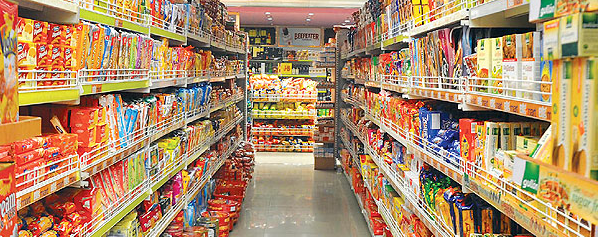

```{r setup, echo = FALSE, message = FALSE, warning = FALSE}
knitr::opts_chunk$set(comment = NA, 
                      fig.width = 6, 
                      fig.height = 6,
                      fig.align = 'center',
                      echo = FALSE, 
                      eval = FALSE, 
                      warning = FALSE)

options(digits = 3)

# Load packages
library(tidyverse)

# Load packages
#wein <- read_csv("_sessions/LinearModelsIII/1_Data/wein.csv")
#bigmart <- read_csv("_sessions/LinearModelsIII/1_Data/bigmart.csv")

```

<p align="center" width="100%">
  
  <br>
  <font style="font-size:10px">from <a href="http://seeksaurav.blogspot.com/2013/01/week-8.html">seeksaurav.blogspot.com</a></font>
</p>


# {.tabset}

## Überblick

Am Ende des Practicals wirst du wissen...

1. Wie du eine logistische Regression zur Analyse von binären Kriterien implementierst und interpretierst. 
2. Wie du eine Poisson Regression zur Analyse von Häufigkeiten implementierst und interpretierst.

## Aufgaben

### A - Setup

1. Öffne dein `TheRBootcamp` R project. 

2. Öffne ein neues R Skript. Schreibe deinen Namen, das Datum und "Lineare Modelle III Practical" als Kommentare an den Anfang des Skripts.

```{r, eval = FALSE, echo = TRUE}
## NAME
## DATUM
## Lineare Modelle III Practical
```

3. Speichere das neue Skript unter dem Namen `lineare_modelle_III_practical.R` im `2_Code` Ordner.

4. Lade die Pakete `tidyverse` und `MASS`.

```{r}
library(tidyverse)
library(MASS)

```

5. Verwende die `read_csv()` Funktion um `wein.csv` und `bigmart.csv` einzulesen.

```{r, echo = T, eval = T, message = F}
# Lese Daten ein
wein <- read_csv(file = "1_Data/wein.csv")
bigmart <- read_csv(file = "1_Data/bigmart.csv")
```

6. Printe die Datensätze. 

7. Verwende `names(XX)`, `summary(XX)`, und `View(XX)` um einen weiteren Überblick über die Daten zu bekommen.

8. Wiederum, führe den Code unten aus um sicherzustellen, dass alle `character` Variablen als Faktoren vorliegen, was den statistischen Modellen hilft kategoriale Variablen richtig zu interpretieren. 

```{r, echo = TRUE}
# Konvertiere alle character zu factor
wein <- wein %>% mutate_if(is.character, factor)
bigmart <- bigmart %>% mutate_if(is.character, factor)
```


### B - Logistische Regression: Wein redux

1. In diesem Abschnitt geht es darum die Analysen der vergangenen Abschnitte umzudrehen und zu untersuchen wie verschiedene Prädiktoren das Kriterium `Farbe` vorhersagen. In anderen Worten, in welchen Gesichtspunkten unterscheiden sich weisse und rote Weine voneinander. Verwende das Template um in einer Regression `Farbe` durch `Alkohol`, `Dichte`, und `Sulphate` vorherzusagen. Achtung: Es tritt ein Fehler auf. Siehe nächste Aufgabe.

```{r, eval = FALSE, echo = TRUE}
# Regression
wein_lm <- lm(formula = XX ~ XX + XX + XX, 
              data = wein)
```

2. Farbe ist natürlich eine kategoriale Variable. Wir können also nicht das Standard-lineare Modell verwenden, sondern müssen auf das generalisierte lineare Modell zurückgreifen. Verwende das Template unten um eine Regression mit `'binomial'` Link und Modell zu fitten, aka eine logistsiche Regression. Nenne das entstehende Objekt `wein_glm`.

```{r, eval = FALSE, echo = TRUE}
# Logistische Regression
wein_glm <- glm(formula = XX ~ XX + XX + XX, 
                data = XX,
                family = 'XX')
```

```{r}
# Logistische Regression
wein_glm <- glm(formula = Farbe ~ Alkohol + Dichte + Sulphate, 
               data = wein,
               family = 'binomial')
```

3. Printe `wein_glm`. Was verrät dir der Output? 

4. Zu allererst ist dir vielleicht aufgefallen, dass einige der Gewichte sehr gross sind. Vor allem der Intercept ist erstaunlich hoch, wenn man bedenkt dass Farbe eigentlich nur Werte zwischen 0 und 1 annehmen kann. Dies hat natürlich mit dem Link-Funktion zu tun. Das bedeutet, im generalisierten linearen Modell muss nun auch noch die Link-Funktion mitberücksichtigt werden.

5. Weiterhin ist die sicher aufgefallen, dass am Schluss des Outputs Ergebnisse angezeigt werden, die bei einem einfachen linearen Modell fehlen. Diese Werte haben etwas damit zu, dass nun mit Maximum Likelihood gefittet wird. Später mehr dazu. 

6. Lasse dir nun die `summary()` anzeigen. Der Output ist sehr ähnlich aufgebaut wie der von `lm()`. Lenke deine Aufmerksamkeit zunächst auf den Teil zu `Coefficients`. Welche Prädiktoren sind signifikant?

7. Alle Prädiktoren tragen signifikant zur Vorhersage der `Farbe` bei. Beachte, dass hier <i>z</i>-Werte anstatt <i>t</i>-Werte angegeben sind, was darauf zurückzuführen ist, dass hier ein anderes Datenmodell verwendet wird. Schaue dir nun den Schlussteil des Outputs an. Analog zur Standard Regression stehen hier Informationen über den Gesamtfit des Modells. Zunächst einmal wird die `Null deviance` angegeben. Dies ist die Performanz des sogenannten Null-Modells, welches nur einen Intercept verwendet. Dieses Modell sagt für jeden Wein schlicht die relative Häufigkeit der häufigeren Kategorie voraus. D.h., im Datensatz ist der Anteil weisser `r mean(wein$Farbe == 'weiss')`. Entsprechend sagt ein solches Modell für jeden Wein voraus, dass eine Wahrscheinlichkeit von `r mean(wein$Farbe == 'weiss')`, dass der Wein weiss ist. Der folgende Code zeigt, wie du damit auf die `Null deviance` kommst. 

```{r, echo = TRUE}
# Wahrscheinlichkeit weiss für Null-Modell
wsk_weiss <- mean(wein$Farbe == 'weiss')

# Log likelihood Null-Modell
log_likelihood <- sum(log(wsk_weiss) * sum(wein$Farbe == 'weiss')) +
                  sum(log(1-wsk_weiss) * sum(wein$Farbe == 'rot'))

# Deviance Null-Modell
-2 * log_likelihood
```

8. Analog kannst du die Performanzwert für das `wein_glm` Modell bestimmen, nur musst du hier die eigentlichen vom Modell vorhergesagten Werte verwenden, die du mit `fitted()` extrahieren kannst.

```{r, echo = TRUE}
# Wahrscheinlichkeit weiss für wein_glm
wsk_weiss <- fitted(wein_glm)

# Log likelihood wein_glm
log_likelihood <- sum(log(wsk_weiss[wein$Farbe == 'weiss'])) + 
                  sum(log(1-wsk_weiss[wein$Farbe == 'rot']))

# Deviance wein_glm
-2 * log_likelihood
```

9. Die Deviance Werte bzw. die log-Likelihoods lassen sich nur schwer absolut beurteilen. Das bedeutet auch, dass nicht ohne weiteres klar ist, ob `wein_glm` tatsächlich gut die `Farbe` erklärt. Bei standard Regression ist das leichter, da `R-squared` notwendigerweise zwischen `0` und `1` liegt. Um die Interpretation zu erleichtert, bietet R daher noch das Akaike Informationskriterium (`AIC`), welches die Deviance in Vergleich zur Anzahl der Parameter setzt, d.h., `AIC <- Deviance + 2*k`, wobei `k` die Anzahl der Parameter (Regressionsgewichte ist). Wenn das `AIC` niedriger ist als die Null-Deviance, dann kann man klar davon ausgehen, dass das Modell (`wein_glm`) besser ist als das Null-Modell. Hier ist dies der Fall, was nicht überraschend ist, da die Prädiktoren jeweils sehr starke Effekte aufweisen.       

10. Dass starke Effekte vorliegen, lässt sich über sogenannte Odds Ratios (OR) darstellen. ORs sind eine übliche Effektstärke in der logistischen Regression, die sich leicht aus Regressionsgewichten ableiten lässt und zwar gilt `OR = exp(b)`, wobei `b` das Regressionsgewicht ist. Berechne die ORs für die drei im Modell enthaltenen Prädiktoren. Es ist i.d.R. einfacher mit positiven Gewichten zu arbeiten, solange man die Richtung in Erinnerung behält. 
 
```{r, echo = TRUE, eval  =FALSE}
# Odds ratios
exp(abs(XX))
exp(abs(XX))
exp(abs(XX))
```

```{r}
# Odds ratios
exp(abs(-0.95293))
exp(abs(-642.70591))
exp(abs(-7.81487))
```

11. Die ORs zeigen, dass die odds (`p / (1-p)`) dafür, dass ein Wein rot ist, um das `2.59` fache steigen, wenn man Alkohol um 1 Volumenprozent zunimmt, um das `1.33e+279` (fast unzählbar) fache, wenn Dichte um einen Wert von 1 steigt, und um das `2477` fache, wenn die Sulphatkonzentration um 1 steigt. Ziemlich extreme Werte oder? Könnte vielleicht wiederum mit der Skalierung zu tun haben. Rechne die logistische Regression erneut, diesmal mit skalierten Variablen.   
 
```{r, eval = FALSE, echo = TRUE}
# Skalierungsfunktion
skaliere = function(x) (x - mean(x))/sd(x)

# Logistische Regression mit Skalierung
wein_glm <- glm(formula = XX ~ XX + XX + XX, 
                data = XX %>% mutate_if(is.numeric, skaliere),
                family = 'XX')
```

```{r}
# Skalierungsfunktion
skaliere = function(x) (x - mean(x))/sd(x)

# Logistische Regression
wein_glm <- glm(formula = Farbe ~ Alkohol + Dichte + Sulphate, 
                data = wein %>% mutate_if(is.numeric, skaliere),
               family = 'binomial')
```
 
12. Nun berechne die ORs noch einmal mit den neuen Gewichten. Sind sie immer noch so extrem?

```{r, echo = TRUE, eval  =FALSE}
# Odds ratios
exp(abs(XX))
exp(abs(XX))
exp(abs(XX))
```

```{r}
# Odds ratios
exp(abs(-1.1366))
exp(abs(-1.9273))
exp(abs(-1.1629))
```

13. Die ORs sollten sich etwas beruhigt haben. Der Grund für die extreme OR für `Dichte` war, dass die Werte in `Dichte` nur zwischen `0.987` und `1.039`, was bedeutet, dass eine Veränderung von 1 eine Veränderung weit über den eigentlichen Wertebereich der Variablen hinausgeht. Wiederum, wenn es um den Vergleich der Gewichte geht und diese leicht interpretierbar werden sollen, erwäge zu standardisieren. 


### C - Poisson Regression: Bigmart

1. Nun zum `bigmart` Datensatz. In diesem Abschnitt geht es `Verkäufe` (Kriterium) auf Basis des maximalen Preis (`Max_Preis`) und der `Visibilität` vorherzusagen. Da es sich beim Kriterium um Häufigkeiten dreht empfiehlt sich eine Regression mit `family = 'poisson'`. Verwende das Template um eine solche zu fitten. 

```{r, eval = FALSE, echo = TRUE}
# Poisson Regression
bigmart_glm <- glm(formula = XX ~ XX + XX, 
                   data = XX,
                   family = 'XX')
```

```{r}
# Poisson Regression
bigmart_glm <- glm(formula = Verkäufe ~ Max_Preis + Visibilität, 
                   data = bigmart,
                   family = 'poisson')
```

2. Printe zunächst das Modell. Wie interpretierst du den Output?

3. Der Output ist genauso aufgebaut wie bei der logistischen Regression. Entgegen was man intuitiv meinen könnte zeigt sich das Preis einen positiven Einfluss auf die Verkäufe hat und Visibilität einen negativen. Die Gewichte der Poisson-Regression sind ebenfalls per `exp()`-Funktion zu transformieren, um sie richtig interpretieren zu können. In diesem Fall ist es aber nicht einfach die Gewichte separat von einander zu betrachten. Siehe die Beispiele unten. 

```{r, echo = TRUE}
# Interpretation der Gewichte
exp(6.71409) # Erwartete Häufigkeit wenn Max_Preis = 0 & Visibilität = 0
exp(6.71409 + 0.00715) # Erwartete Häufigkeit wenn Max_Preis = 1 & Visibilität = 0
exp(6.71409 - 2.11849) # Erwartete Häufigkeit wenn Max_Preis = 0 & Visibilität = 1
exp(6.71409 + 0.00715 - 2.11849) # Erwartete Häufigkeit wenn Max_Preis = 1 & Visibilität = 1
```

4. Evaluiere nun die `summary()`. Was beobachtest du?

5. Alle Effekte sind signifikant, trotz des teilweise kleinen Einflusses (im Fall von `Max_Preis`), was sicherlich der grossen Stichprobe zu schulden ist. Nichtsdestotrotz, zeigt die `Residual deviance` einen klar niedrigeren Wert als die `Null deviance`. Was sagt dir dies? 


### D - Negative binomial Regression: Bigmart

1. Heutzutage wird dem Poisson Modell oftmals das Negative Binomial Modell vorgezogen, welches eine Verallgemeinerung des ersteren darstellt. Verwende die `glm.nb()` aus dem `MASS` Paket um eine solche Regression mit denselben Variablen wie zuletzt zu rechnen. Verwende das Template unten.

```{r, eval = FALSE, echo = TRUE}
# Lade MASS
library(MASS)

# Negative Binomial Regression
bigmart_glm.nb <- glm.nb(formula = XX ~ XX + XX, 
                         data = XX)
```

```{r}
# Lade MASS
library(MASS)

# Poisson Regression
bigmart_glm.nb <- glm.nb(formula = Verkäufe ~ Max_Preis + Visibilität, 
                      data = bigmart)
```

2. Printe das Objekt und vergleiche die Regressionsgewichte mit denen der Poisson Regression. Hat sich was verändert?

3. Nein, die Regressionsgewichte sind sehr stabil geblieben. Print die `summary()`. Was beobachtest du?

4. Alle Effekt sind immer noch signifikant. Was sich jedoch geändert hat sind die Deviances, was mit einem komplexen zweistufigen Fitting-Prozess zu tun hat. Vergleichbar sind aber immer noch AIC und der Wert der ganz am Ende angegeben wird, welcher die volle Deviance für das Modell ist. Du wirst feststellen, dass beide Werte deutlich besser ausfallen, als bei der Poisson Regression, was nahelegt, dass das Negative-Binomial Modell tatsächlich geeigneter ist, die Daten zu beschreiben. 


## Beispiele

```{r, eval = FALSE, echo = TRUE}
# Regression mit R

library(tidyverse)

# Model:
# Sagt der Hubraum (displ) die pro gallone 
# fahrbaren Meilen voraus?
hwy_mod <- lm(formula = hwy ~ displ,
               data = mpg)

# Ergebnisse 
summary(hwy_mod)
coef(hwy_mod)

# Gefittete Werte
hwy_fit <- fitted(hwy_mod)
hwy_fit

# Residuums 
hwy_resid <- residuals(hwy_mod)
hwy_resid


```


## Datensätze

|Datei | Zeile | Spalte |
|:----|:-----|:------|
|[wein.csv](https://raw.githubusercontent.com/therbootcamp/SmR_2020Mai/master/1_Data/wein.csv) | 6497 | 13 |

#### wein.csv

Der `wein.csv` Datensatz enthält aus den Jahren 2004 bis 2007 des Comissão De Viticultura Da Região Dos Vinhos Verdes, der Offiziellen Zertifizierungsagentur des Vinho Verde in Portugal. 

| Name | Beschreibung |
|:-------------|:-------------------------------------|
|Qualität | Qualitätsurteil über den Weins von 1-9 |
|Farbe| Roter oder weisser Wien |
|Gelöste_Säure| Konzentration der im Wein gelösten Säuren |
|Freie_Säure| Konzentration der verflüchtigbaren Säuren |
|Citronensäure| Citronensäurekonzentration im Wein |
|Restzucker| Zuckerkonzentration im Wein|
|Chloride| Chloridkonzentration im Wein|
|Freie_Schwefeldioxide| Konzentration der verflüchtigbaren Schwefeldioxide |
|Gesamt_Schwefeldioxide| Konzentration der Schwefeldioxide insgesamt |
|Dichte|Dichte des Weins|
|pH_Wert|pH-Wert des Weins. Je kleiner, desto sauerer. |
|Sulphate| Sulphatkontration im Wein |
|Alkohol| Alkoholkonzentration im Wein in %|

#### bigmart.csv

Der `bigmart.csv` Datensatz enthält Verkaufszahlen einer nationalen Supermarktkette in Nepal aus dem Jahre 2013 für 1559 Produkte und 10 verschiedene Supermarktfilialen. 

| Name | Beschreibung |
|:-------------|:-------------------------------------|
|Verkäufe|Verkaufszahlen|
|Gewicht|Gewicht des Produkts|
|Fettgehalt|Normal oder niedrig (low-fat)|
|Visibilität| Verkaufsfläche für das Produkt  |
|Typ| Art des Produkts |
|Max_Preis| Maximaler Preis |
|Ladengrösse| Ladengrösse |


## Funktionen

### Pakete

|Package| Installation|
|:------|:------|
|`tidyverse`|`install.packages("tidyverse")`|
|`MASS`|`install.packages("MASS")`|

### Funktionen

| Function| Package | Description |
|:---|:------|:---------------------------------------------|
|   `glm`|`stats`| Fitte ein generalisiertes lineares Modell  |
|   `fitted`|`stats`| Extrahiere vorhergesagte Werte|
|   `residuals`|`stats`| Extrahiere Residuen |
|   `gml.nb`|`MASS`| Fit a (generalized) linear model with negative binomial links| 


## Resourcen

### Books

- Hilfreiche [Vignette](https://cran.r-project.org/web/packages/pscl/vignettes/countreg.pdf) über Regressionen für Häufigkeiten mit R.

- [Discovering Statistics with R](https://www.amazon.com/Discovering-Statistics-Using-Andy-Field/dp/1446200469) von Andy Field ist sehr gut
- [YaRrr! The Pirate's Guide to R](https://bookdown.org/ndphillips/YaRrr/) hat hilfreiche und unterhaltsame Kapitel zu Statistik mit R.