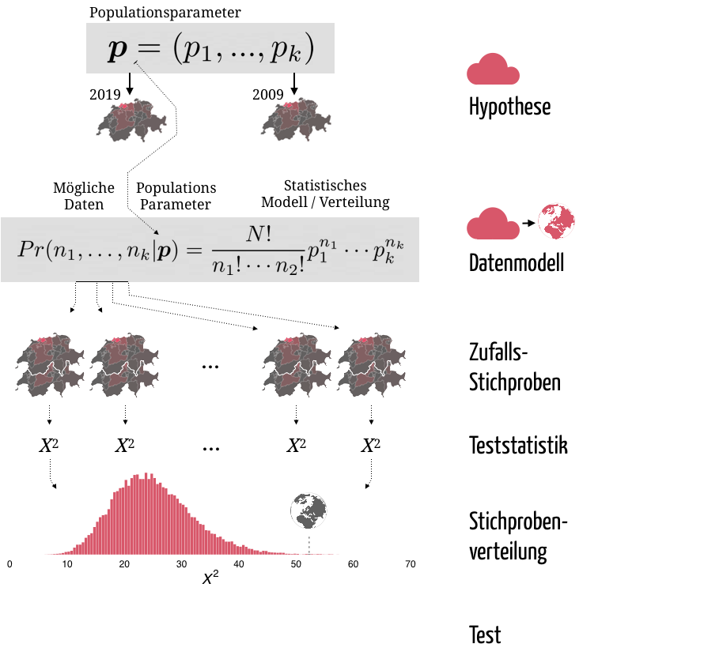
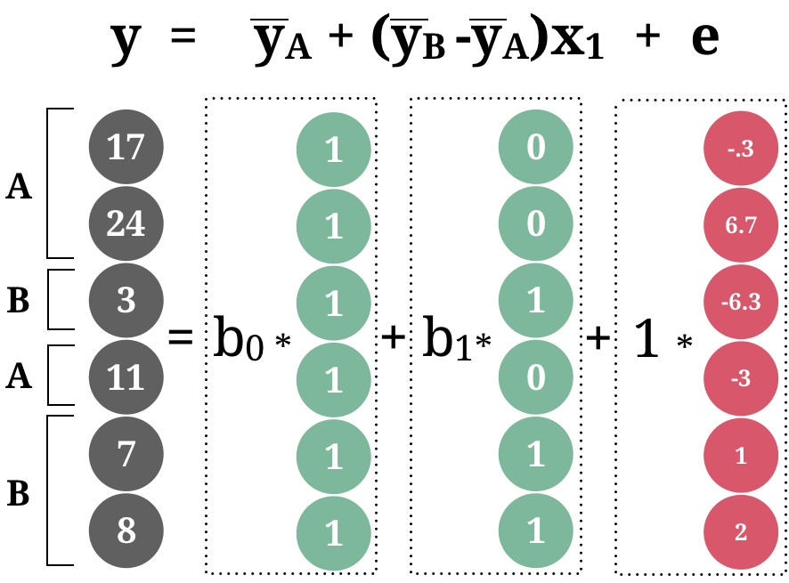

layout: true

<div class="my-footer">
  <span style="text-align:center">
    <span> 
      
    </span>
    <a href="https://therbootcamp.github.io/">
      <span style="padding-left:82px"> 
        <font color="#7E7E7E">
          www.therbootcamp.com
        </font>
      </span>
    </a>
    <a href="https://therbootcamp.github.io/">
      <font color="#7E7E7E">
       Statistik mit R | September 2020
      </font>
    </a>
    </span>
  </div> 
  
---

```{r, eval = TRUE, echo = FALSE, warning=F,message=F}
# Code to knit slides

```

```{r setup, include=FALSE}
options(htmltools.dir.version = FALSE)
options(width = 110)
options(digits = 4)

# Load packages
require(tidyverse)

print2 <- function(x, nlines=10,...) {
   cat(head(capture.output(print(x,...)), nlines), sep="\n")}

# Load data
baselers <- readr::read_csv("1_Data/baselers.csv")

# get color palette functions
source("../../_materials/palette/therbootcamp_palettes.R")
colors = baselrbootcamp_colors

knitr::opts_chunk$set(dpi = 300, echo = FALSE, warning = FALSE, fig.align = 'center', message= FALSE)

```


.pull-left35[

# <i>p</i>-Wert

<ul>
  <li class="m1"><span><high>Vergleich der beobachteten Werte mit der Stichprobenverteilung</high> unter H0 verrät wie konsistent die gemachten Beobachtungen mit der H0 sind.</span></li>
    <li class="m2"><span>Möglichkeiten</span></li>
    <ul class="level">
    <li><span><b>Likelihood</b></li></span>
    <li><span><high>Extremität</high></li></span>
    </ul> 
</ul>
]

.pull-right5[

<p align = "left" >
  
</p>

]

---


# Multiple lineare regression

.pull-left4[

<ul>
  <li class="m1"><span>Wie beschreiben <high>mehrere linear verknüpfte Prädiktoren (x) zusammen</high> das Krierium (y)?</span></li>
  <li class="m2"><span>Parameter:</span></li>
  <ul class="level">
    <li><span>&beta;<sub>0</sub>: <high>Intercept</high> oder y-Achsenabschnitt</span></li>
    <li><span>&beta;<sub>1</sub>: <high>Slope</high> für x<sub>1</sub></span></li>
    <li><span>&beta;<sub>2</sub>: <high>Slope</high> für x<sub>2</sub></span></li>
    <li><span>&beta;<sub>k</sub>: <high>Slope</high> für x<sub>k</sub></span></li>
  </ul>
</ul>

<br>

$$\Large \hat{y} = b_0 + b_1  \cdot x_1 + ... b_k \cdot x_k$$

]

.pull-right5[

```{r, echo = FALSE, fig.width = 3.5, fig.height = 3}

library(tidyverse) ; library(ggrepel)


# Berechne Nächte per Region
d = read_csv('1_Data/Tourismus.csv')  %>%
  mutate(Nächte = Besucher * Dauer) %>%
  left_join(read_csv('1_Data/Europa.csv') ) %>% 
  filter(!is.na(Äquivalenzeinkommen))


m = lm(Nächte_log2 ~ Äquivalenzeinkommen + Bevölkerung, data = d %>% mutate(Nächte_log2 = log2(Nächte)))

res <- 1000

#Setup Axis
x <- seq(min(d$Äquivalenzeinkommen), max(d$Äquivalenzeinkommen), by = res)
y <- seq(min(d$Bevölkerung), max(d$Bevölkerung), by = res)

#Sample points
surface <- expand.grid(Äquivalenzeinkommen = x,
                       Bevölkerung = y, 
                       KEEP.OUT.ATTRS = F)
surface$Nächte_log2 <- predict.lm(m, newdata = surface)
surface <- reshape2::acast(surface, Bevölkerung ~ Äquivalenzeinkommen, value.var = "Nächte_log2")

require(plotly)
plt = plot_ly(d %>% mutate(Nächte_log2 = log2(Nächte)), 
        x = ~Äquivalenzeinkommen, 
        y = ~Bevölkerung, 
        z = ~Nächte_log2,
        type = "scatter3d",
        width = 500, height = 420)

plt = add_trace(p = plt,
          z = surface,
          x = x,
          y = y,
          type = "surface",
        showscale=FALSE) 
plt %>%  layout(showlegend = FALSE)
   

```

]


---

# Parameterschätzungen

.pull-left4[


<ul>
  <li class="m1"><span>Die Schätzung basiert auf dem <high>Kleinsten-Quadrate Kriterium</high>.</span></li>
  </ul>
</ul>

<br>

$$\Large b_1 = \frac{r_{x_1y}-r_{x_2y}r_{x_2x_1}}{1-r_{x_2x_1}^2} \cdot \frac{s_y}{s_{x_1}}$$
$$\Large b_2 = \frac{r_{x_2y}-r_{x_1y}r_{x_1x_2}}{1-r_{x_1x_2}^2} \cdot \frac{s_y}{s_{x_2}}$$

$$\Large b_0 = \bar{y} + b_1 \cdot \bar{x_1} + b_2 \cdot \bar{x_2}$$

]

.pull-right5[


```{r, echo = FALSE, fig.width = 3.5, fig.height = 3}

library(tidyverse) ; library(ggrepel)

# Lade Tourismus Daten
tour <- read_csv('1_Data/Tourismus.csv') 
europa <- read_csv('1_Data/Europa.csv') 

# Berechne Nächte per Region
d = tour %>%
  mutate(Nächte = Besucher * Dauer) %>%
  left_join(europa) %>% 
  filter(!is.na(Äquivalenzeinkommen))


m = lm(Nächte_log2 ~ Äquivalenzeinkommen + Bevölkerung, data = d %>% mutate(Nächte_log2 = log2(Nächte)))

res <- 1000

#Setup Axis
x <- seq(min(d$Äquivalenzeinkommen), max(d$Äquivalenzeinkommen), by = res)
y <- seq(min(d$Bevölkerung), max(d$Bevölkerung), by = res)

#Sample points
surface <- expand.grid(Äquivalenzeinkommen = x,
                       Bevölkerung = y, 
                       KEEP.OUT.ATTRS = F)
surface$Nächte_log2 <- predict.lm(m, newdata = surface)
surface <- reshape2::acast(surface, Bevölkerung ~ Äquivalenzeinkommen, value.var = "Nächte_log2")

require(plotly)
plt = plot_ly(d %>% mutate(Nächte_log2 = log2(Nächte)), 
        x = ~Äquivalenzeinkommen, 
        y = ~Bevölkerung, 
        z = ~Nächte_log2,
        type = "scatter3d",
        width = 500, height = 420)

plt = add_trace(p = plt,
          z = surface,
          x = x,
          y = y,
          type = "surface",
        showscale=FALSE) 
plt %>%  layout(showlegend = FALSE)
   

```


]


---

# Datenmodell

.pull-left4[

<ul>
  <li class="m1"><span>Gemäss dem Datenmodell der Regression folgen die Kriteriumswerte einer <high>Normalverteilung um den vorhergesagten Wert</high></span></li>
  </ul>
</ul>

<br>

$$\Large y \sim \mathcal{N}(\hat{y}, \sigma_e)$$
<br>

$$\large p(x|\mu, \sigma) = \frac{1}{\sigma \sqrt 2\pi}e^{-(x-\mu)/2\sigma^2}$$

]

.pull-right5[

```{r, echo = FALSE, fig.width = 3.5, fig.height = 3}

library(tidyverse) ; library(ggrepel)

# Lade Tourismus Daten
tour <- read_csv('1_Data/Tourismus.csv') 
europa <- read_csv('1_Data/Europa.csv') 

# Berechne Nächte per Region
d = tour %>%
  mutate(Nächte = Besucher * Dauer) %>%
  left_join(europa) %>% 
  filter(!is.na(Äquivalenzeinkommen)) %>% 
  mutate(Nächte_log2 = log2(Nächte))

m = lm(Nächte_log2~ Äquivalenzeinkommen, data = d)

norm = dnorm(seq(4,14,.1),predict(m)[2], sd(resid(m))) * 10000
norm = norm - min(norm)
tbl1 = tibble(
       x = c(d$Äquivalenzeinkommen[2], d$Äquivalenzeinkommen[2]+norm, d$Äquivalenzeinkommen[2], d$Äquivalenzeinkommen[2]), 
       y = c(4, seq(4,14,.1), 14, 4))

norm = dnorm(seq(4,14,.1),predict(m)[7], sd(resid(m))) * 10000
norm = norm - min(norm)
tbl2 = tibble(
       x = c(d$Äquivalenzeinkommen[7], d$Äquivalenzeinkommen[7]+norm, d$Äquivalenzeinkommen[7], d$Äquivalenzeinkommen[7]), 
       y = c(4, seq(4,14,.1), 14, 4))

ggplot(d, 
       aes(x = Äquivalenzeinkommen, 
           y = Nächte_log2)) +
  geom_segment(
    aes(x = Äquivalenzeinkommen, xend = Äquivalenzeinkommen,
        y = predict(m), yend = Nächte_log2), linetype=3) +
  geom_polygon(data = tbl1, mapping = aes(x = x, y = y),size=1.3,fill=rgb(0,0,0,alpha=.3)) + 
  geom_polygon(data = tbl2, mapping = aes(x = x, y = y),size=1.3,fill=rgb(0,0,0,alpha=.3)) + 
  geom_point() +
  geom_abline(intercept = coef(m)[1], slope = coef(m)[2], col = '#EA4B68', size = 1.5) + 
  theme_bw() + 
  labs(y = 'log2(Nächte)')

```

]

---

# Teststatistik

.pull-left4[

<ul>
  <li class="m1"><span>Die Betagewichte folgen einer <high>t-Verteilung</high>.</span></li>
  <li class="m2"><span>Die Verteilung hängt von <high>Freiheitsgraden &nu;</high> ab.</span></li>
  </ul>
</ul>

<br>

$$\Large t_\nu=\frac{\beta_j}{\sigma_{\beta_j}}$$

<br>

$$\Large \nu = n - k - 1$$

]

.pull-right5[

```{r, echo = FALSE, fig.width = 3.5, fig.height = 3}

library(tidyverse) ; library(ggrepel)

# Lade Tourismus Daten

x = seq(-6,6,.01)
par(mar=c(4,3,1,1))
plot.new();plot.window(xlim=c(-6,6),ylim=c(0,.4))
axis(1)
legend('right',legend=c(expression(paste(nu," = Inf")),expression(paste(nu," = 10")),expression(paste(nu," = 2"))),horiz = F, lwd=3,col=colors[c('green','grey','magenta')],bty='n')
lines(x, dt(x, df = Inf), lwd=3, col = colors['green'])
lines(x, dt(x, df = 10), lwd=3, col = colors['grey'])
lines(x, dt(x, df = 2), lwd=3, col = colors['magenta'])
mtext(c('t-Verteilung','Dichte','t'),side=c(3,2,1),font=c(2,1,1),line=c(0,0,2.5))

```

]

---


# t-Test

.pull-left4[

<ul>
  <li class="m1"><span>Der Test vergleicht den beobachteten t-Wert mit entweder...</span></li>
  <ul>
    <li><span>Einseitig: t<sub>&alpha;</sub></span></li>
    <li><span>Zweiseitig: t<sub>&alpha;/2</sub></span></li>
  </ul>
 </ul>
</ul>

<br>

$$\Large t_\nu=\frac{\beta_j}{\sigma_{\beta_j}}>t_{\nu,\alpha}$$
<br>

$$\Large t_\nu=\frac{\beta_j}{\sigma_{\beta_j}}>t_{\nu,\frac{\alpha}{2}}$$

]

.pull-right5[

```{r, echo = FALSE, fig.width = 3.5, fig.height = 3}

library(tidyverse) ; library(ggrepel)

colTrans = function(col,perc) {
  rgb(t(grDevices::col2rgb(col)), maxColorValue=255, alpha = perc*255)
}

par(mar=c(2,1,1,1),mfrow=c(2,1))
plot.new();plot.window(xlim=c(-6,6),ylim=c(0,.4))
axis(1,labels = F)
rect(qt(.95,10),0,6,.15,col=colTrans(colors['magenta'],.2),border=NA)

x = seq(qt(.95,10),6,.01)
polygon(c(x[1],x,x[1]),c(0,dt(x, df = 10),0),col=colors['magenta'],border=NA)

text(qt(.95,10)-.7,.025,labels=expression(alpha))
text(4,.1,labels=c('Signifikant'),font=2,col='white',cex=1)

x = seq(-6,6,.01)
lines(x, dt(x, df = 10), lwd=3, col = colors['grey'])
mtext(c('Einseitig','Dichte','t'),side=c(3,2,1),font=c(2,1,1),line=c(0,0,.5))


plot.new();plot.window(xlim=c(-6,6),ylim=c(0,.4))
axis(1,labels = F)
rect(-6,0,qt(.025,10),.15,col=colTrans(colors['magenta'],.2),border=NA)
rect(qt(.975,10),0,6,.15,col=colTrans(colors['magenta'],.2),border=NA)

x = seq(qt(.975,10),6,.01)
polygon(c(x[1],x,x[1]),c(0,dt(x, df = 10),0),col=colors['magenta'],border=NA)
x = seq(-6,-qt(.975,10),.01)
polygon(c(x[1],x,x[length(x)]),c(0,dt(x, df = 10),0),col=colors['magenta'],border=NA)

text(qt(.975,10)-.7,.025,labels=expression(alpha/2))
text(qt(.025,10)+.7,.025,labels=expression(alpha/2))

text(-4.11,.1,labels=c('Signifikant'),font=2,col='white',cex=1)
text(4.1,.1,labels=c('Signifikant'),font=2,col='white',cex=1)

x = seq(-6,6,.01)
lines(x, dt(x, df = 10), lwd=3, col = colors['grey'])
mtext(c('Zweiseitig','Dichte','t'),side=c(3,2,1),font=c(2,1,1),line=c(0,0,.5))

```

]

---

# Designmatrix

.pull-left4[

<ul>
  <li class="m1"><span>Kategoriale Variablen müssen für die Regression in  <high>k-1 neue Variablen kodiert werden</high>.</span></li>
  <li class="m2"><span>Zwei Kodierungsarten:</span></li>
  <ul>
    <li><span><high>Dummy coding</high> setzt Werte einer Kategorie auf 1, anonsten 0<br>&rarr; <high>intercept = 0-Kategorie</high></span></li><br>
    <li><span><high>Effect coding</high> setzt Werte einer Kategorie auf 1, anonsten -1<br>&rarr; <high>Intercept  = &#563;</high></span></li>
  </ul>
</ul>

]

.pull-right5[

<p align="center">



</p>
]


---


# Interaktionen

.pull-left35[
<ul>
  <li class="m1"><span>Interaktionen modellieren <high>Moderationseffekte</high>.</span></li>
  <li class="m2"><span>Moderation: Effekt einer Variable wird durch eine andere Variable moderiert.</span></li>
</ul>
]


.pull-right5[

```{r, echo = FALSE, fig.width = 3.5, fig.height = 3}

library(tidyverse) ; library(ggrepel)

# Berechne Nächte per Region
d = read_csv('1_Data/Tourismus.csv') %>%
  mutate(Nächte = Besucher * Dauer) %>%
  left_join(read_csv('1_Data/Europa.csv')) %>% 
  filter(!is.na(Äquivalenzeinkommen)) %>% 
  mutate(Nächte_log = log2(Nächte))

m = lm(Nächte_log ~ Äquivalenzeinkommen + Bevölkerung, data = d %>% mutate(Nächte_log = log2(Nächte)))

res <- 1000

#Setup Axis
x <- seq(min(d$Äquivalenzeinkommen), max(d$Äquivalenzeinkommen), by = res)
y <- seq(min(d$Bevölkerung), max(d$Bevölkerung), by = res)

#Sample points
surface <- expand.grid(Äquivalenzeinkommen = x,
                       Bevölkerung = y, 
                       KEEP.OUT.ATTRS = F)
surface$Nächte_log2 <- predict.lm(m, newdata = surface)
surface <- reshape2::acast(surface, Bevölkerung ~ Äquivalenzeinkommen, value.var = "Nächte_log2")

require(plotly)
plt = plot_ly(d %>% mutate(Nächte_log = log2(Nächte)), 
        x = ~Äquivalenzeinkommen, 
        y = ~Bevölkerung, 
        z = ~Nächte_log,
        type = "scatter3d",
        width = 500, height = 420)

plt = add_trace(p = plt,
          z = surface,
          x = x,
          y = y,
          type = "surface",
        showscale=FALSE) 
plt %>%  layout(showlegend = FALSE)
   

```

]

---

# Interaktionen

.pull-left35[
<ul>
  <li class="m1"><span>Interaktionen modellieren <high>Moderationseffekte</high>.</span></li>
  <li class="m2"><span>Moderation: Effekt einer Variable wird durch eine andere Variable moderiert.</span></li>
</ul>
]


.pull-right55[

```{r, echo = T, eval = F, fig.width = 3.5, fig.height = 3}
# Regression mit Interaktion
mod <- 
  lm(Nächte_log ~ Äquivalenzeinkommen * Bevölkerung, 
     tour)

# Regressionstests
summary(mod)$coef
```

```{r, echo = F, fig.width = 3.5, fig.height = 3}
# Berechne Nächte per Region
tour = read_csv('1_Data/Tourismus.csv')  %>%
  mutate(Nächte = Besucher * Dauer,
         Nächte_log = log2(Nächte)) %>%
  left_join(read_csv('1_Data/Europa.csv') ) 

# Regression mit Interaktion
mod <- 
  lm(Nächte_log ~ Äq.Eink. +
                  Bevölk. + 
                  Äq.Eink.:Bevölk. , 
   tour %>% rename(Äq.Eink. = Äquivalenzeinkommen,
                          Bevölk. = Bevölkerung))

# Regressionstests
round(summary(mod)$coef,6)
```


]

---

# Interaktionen

.pull-left35[
<ul>
  <li class="m1"><span>Interaktionen modellieren <high>Moderationseffekte</high>.</span></li>
  <li class="m2"><span>Moderation: Effekt einer Variable wird durch eine andere Variable moderiert.</span></li>
</ul>
]


.pull-right55[

```{r, echo = T, eval=FALSE, fig.width = 3.5, fig.height = 3}
# Regression mit Interaktion
mod <- 
  lm(Nächte_log ~ Äquivalenzeinkommen +
                  Bevölkerung + 
                  Äquivalenzeinkommen:Bevölkerung, 
     tour)

# Regressionstests
summary(mod)$coef
```

```{r, echo = F, fig.width = 3.5, fig.height = 3}


# Regression mit Interaktion
mod <- 
  lm(Nächte_log ~ Äq.Eink. +
                  Bevölk. + 
                  Äq.Eink.:Bevölk. , 
     tour %>% rename(Äq.Eink. = Äquivalenzeinkommen,
                     Bevölk. = Bevölkerung))

# Regressionstests
round(summary(mod)$coef,6)
```


]

---


# Logistische Regression

.pull-left4[

<ul>
  <li class="m1"><span>Dient der Vorhersage von <high>dichotomen Variablen</high>, d.h., Ja/Nein, 1/0, etc.</span></li>
  <li class="m2"><span>Basiert auf einem <high>logit-link mit Binomialem Datenmodell</high>.</span></li>
</ul>

<br>

$$\Large \hat{y} = p(y = 1) = \frac{1}{1 + e^{-b_0+b_1*x}}$$
]


.pull-right5[

```{r, echo = F, fig.width = 3.5, fig.height = 3}


# Lade Tourismus Daten
tour <- read_csv('1_Data/Tourismus.csv') 
europa <- read_csv('1_Data/Europa.csv') 

# Berechne Nächte per Region
tour = tour %>%
  mutate(Nächte = Besucher * Dauer) %>%
  left_join(europa) %>% 
  mutate(Europa = ifelse(Region == 'Europa', 1,0))

d = tour %>% mutate(Besucher = log(Besucher))

m = glm(Europa ~ Besucher, data = d, family = 'binomial')
logist = function(x) 1/(1 + exp(-(coef(m)[1] + coef(m)[2] * x)))
ggplot(d, 
       aes(x = Besucher, 
           y = Europa)) +
  geom_segment(
    aes(x = Besucher, xend = Besucher,
        y = fitted(m), yend = Europa), linetype=3,size=.3) +
  geom_point() +
  geom_line(data = tibble(d = seq(-3,13,.1), l = logist(seq(-3,13,.1))), aes(x =d, y = l), col = '#EA4B68', size = 1.5) + 
  theme_bw() + ylim(c(0,1)) + xlim(c(-3,13)) + labs(x='log(Besucher)',y="Europa: 1 = Ja, 0 = Nein")

```

]

---

# Maximum Likelihood

.pull-left4[

<ul>
  <li class="m1"><span>Maximum Likelihood ist neben Kleinste-Quadrate (OLS) die <high>wichtigste "Loss"-function der Statistik</high>.</span></li>
  <li class="m2"><span><high>Koinzidiert mit OLS</high> für nicht-generalisierte Modelle.</span></li>
</ul>

<br>

$$\large \mathbf{b} = \underset{\mathbf{b}}{\operatorname{argmax}} L\big(y_i|{\mathbf{b}}\big)$$

<p align="center" style="padding-bottom:5px;margin-top:0px;padding-top:20px"><u>Binomialmodell</u></p>

$$\large L(y_i|\mathbf{b})= \binom{n}{k} p_{y_i=1}^k(1-p_{y_i=1})^{n-k}$$

]

.pull-right5[

```{r, echo = F, fig.width = 3.5, fig.height = 3}

m = glm(Europa ~ Besucher, data = d, family = 'binomial')
logist = function(x) 1/(1 + exp(-(coef(m)[1] + coef(m)[2] * x)))
ggplot(d, 
       aes(x = Besucher, 
           y = Europa)) +
  geom_segment(
    aes(x = Besucher, xend = Besucher,
        y = fitted(m), yend = Europa), linetype=3,size=.3) +
  geom_point() +
  geom_line(data = tibble(d = seq(-3,13,.1), l = logist(seq(-3,13,.1))), aes(x =d, y = l), col = '#EA4B68', size = 1.5) + 
  theme_bw() + ylim(c(0,1)) + xlim(c(-3,13)) + labs(x='log(Besucher)',y="Europa: 1 = Ja, 0 = Nein")

```

]

---


# `glm()`

.pull-left35[

<ul>
  <li class="m1"><span><high>Generalisierte lineare Modelle</high> können mit <mono>glm()</mono> spezifiziert werden.</high></span></li>
  <li class="m2"><span>Argument <mono>family</mono> bestimmt <high>Link und Datenmodell</high>.</span></li>
</ul>


]

.pull-right55[

```{r, echo = T, fig.width = 3.5, fig.height = 3}
# Logistische Regression
mod <- glm(Europa ~ Besucher, 
           data = tour, 
           family = 'binomial')
mod
```

]

---


class: middle, center

<h1><a href=https://therbootcamp.github.io/SmR_2020Sep/index.html>Schedule</a></h1>
