---


```{r, eval = TRUE, echo = FALSE, warning=F,message=F}
# Code to knit slides

```

```{r setup, include=FALSE}
options(htmltools.dir.version = FALSE)
options(width = 110)
options(digits = 4)

# Load packages
require(tidyverse)

print2 <- function(x, nlines=10,...) {
   cat(head(capture.output(print(x,...)), nlines), sep="\n")}

# Load data
baselers <- readr::read_csv("1_Data/baselers.csv")

# get color palette functions
source("../../_materials/palette/therbootcamp_palettes.R")
colors = baselrbootcamp_colors

knitr::opts_chunk$set(dpi = 300, echo = FALSE, warning = FALSE, fig.align = 'center', message= FALSE)

```


# Robuste Statistik

.pull-left45[

### Parametrische Annahmen

<ul>
  <li class="m1"><span>Parametrische Modelle / Tests kommen mit <high>starken Annahmen</high>.</span></li>
  <li class="m2"><span>Für <high>Effizienz und Verzerrungsfreiheit</high> sollten diese Annahmen erfüllt sein.</span></li>
</ul>

<br>

### Nicht-parametrische Statistik

<ul>
  <li class="m3"><span>Nicht-parametrische Modelle kommen <high>ohne Annahmen über die Verteilung</high> in der Population aus.</span></li>
  <li class="m4"><span>Involviert <high>Rangbildung</high>, <high>Kombinatorik</high> und <high>Bootstrap</high>.</span></li>
</ul>

]

.pull-right45[

<p align = "center">
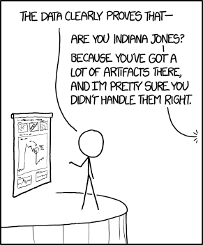<br>
<font style="font-size:10px">from <a href="https://xkcd.com/1781/">xkcd.com</a></font>
</p>


]

---

# Annahmen der Regression

.pull-left45[

Auf Deutsch...

<ul>
  <li class="m1"><span>Passen die Daten?</span></li>
  <ul>
    <li><span>Quantitativ oder dichotom (A1)</span></li>
    <li><span>Varianz grösser Null (A2)</span></li>
    <li><span>Interkorrelation moderat (A3)</span></li>
  </ul>
  <li class="m2"><span>Passt das Modell?</span></li>
  <ul>
    <li><span>Linearer Zusammenhang (A4, A5, A7)</span></li>
    <li><span>Konstante Fehlervarianz (A6)</span></li>
    <li><span>Normalverteilte Fehler (A8)</span></li>
  </ul>  
</ul>

]

.pull-right45[

<p align = "center">
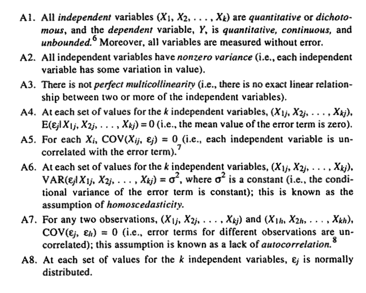<br>
<font style="font-size:10px">from <a href="">Berry (1993)</a></font>
</p>


]

---

# Passen die Daten?

.pull-left45[

<ul>
  <li class="m1"><span>Ein typisches Daten-Problem sind <high>zu hohe Prädiktorkorrelationen</high>.</span></li>
  <br>
  <ul>
    <li><span><high>Singularität</high> - Mindestens ein Prädiktor kann <high>vollständig</high> durch andere erklärt werden.</span></li>
    <br>
    <li><span><high>Multikollinearität</high> - Mindestens ein Prädiktor kann <high> fast vollständig</high> durch andere erklärt werden.</span></li>
  </ul>
  <br>
  <li class="m2"><span>Der <high>Variance Inflation Factor</high> (VIF) schätzt das Ausmass an Multikollinearität. Literatur empfiehlt VIF<10 <a href="https://therbootcamp.github.io/SwR_2019Apr/_sessions/RobustStats/literature/Stine1995.pdf">(Stine, 1995)</a>.</span></li>
</ul>

]

.pull-right45[

<p align = "center">
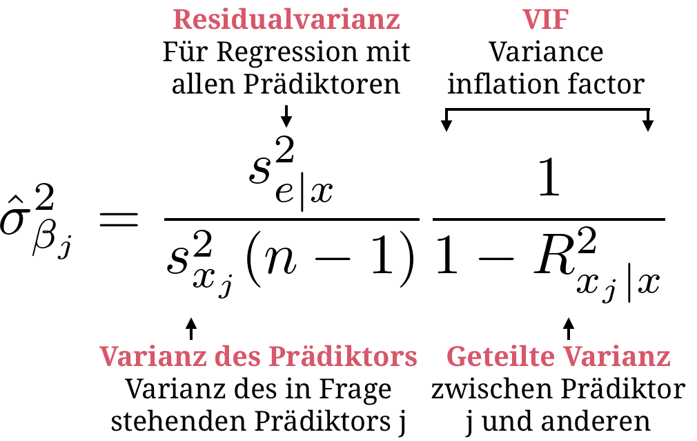
</p>

]
---

# Passt das Modell?

.pull-left45[

<ul>
  <li class="m1"><span>Die Passung des Modells wird bestenfalls über <high>graphische Illustrationen</high> bestimmt.</span></li>
  <br>
  <li class="m2"><span><high>Statistische Kennwerte</high> können zusätzliche Informationen liefern.</span></li>
</ul>


<table style="cellspacing:0; cellpadding:0; border:none; padding-top:10px">
  <col width="50%">
  <col width="50%">
<tr>
  <td bgcolor="white">
    <b>Annahme</b>
  </td>
  <td bgcolor="white">
    <b>Statistik</b>
  </td>  
</tr>
<tr>
  <td bgcolor="white">
    Linearität
  </td>
  <td bgcolor="white">
   <mono>lm</mono>, <mono>glm</mono> (curve fitting)
  </td>  
</tr>
<tr>
  <td bgcolor="white">
    Homoskedastizität
  </td>
  <td bgcolor="white">
    <mono>bartlett.test</mono>
  </td>  
</tr>
<tr>
  <td bgcolor="white">
    Normalität
  </td>
  <td bgcolor="white">
    <mono>skewness</mono>, <mono>kurtosis</mono>, <mono>shapiro.test</mono>
  </td>  
</tr>
<tr>
  <td bgcolor="white">
    Ausreisser
  </td>
  <td bgcolor="white">
    <mono>cooks.distance</mono>, <mono>mahalanobis</mono>, etc.
  </td>  
</tr>
</table>

]


.pull-right45[

<p align = "center">
<font style="font-size=10px"><i>Einfache Regression</i></font><br>
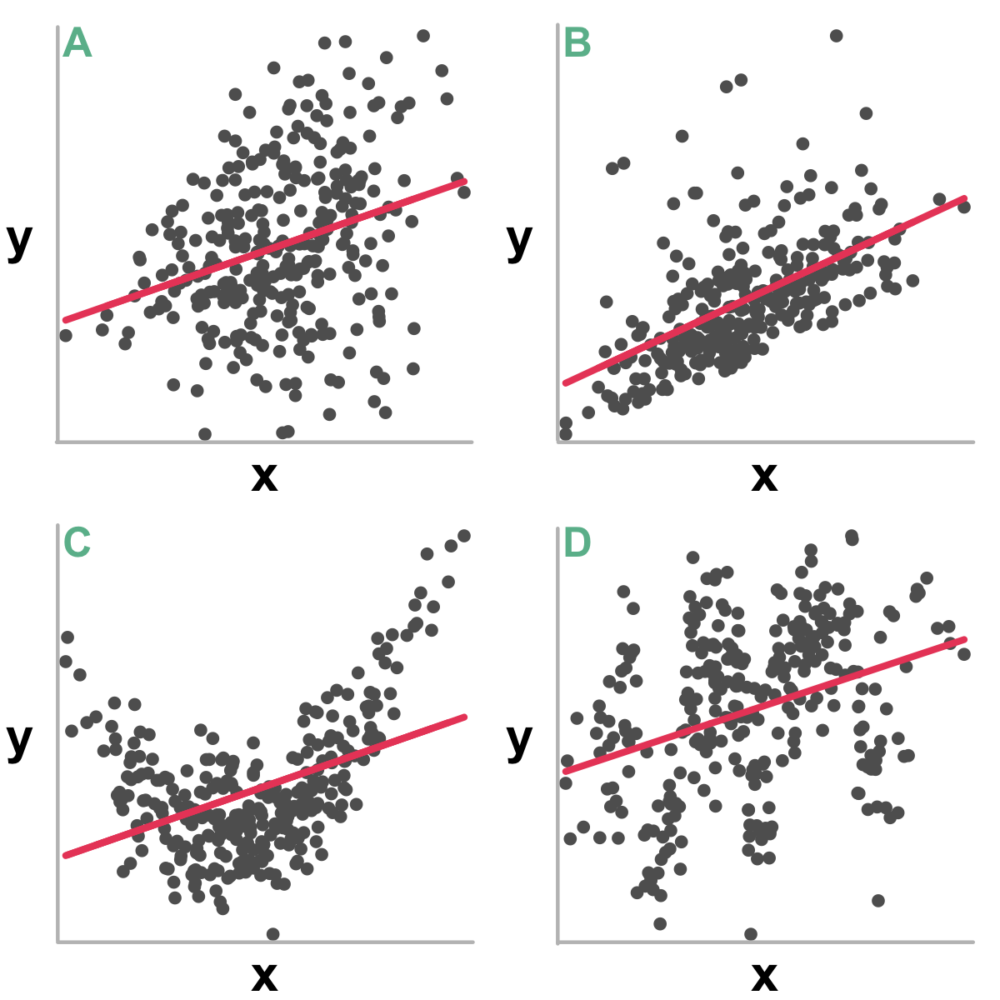
</p>

]

---

# Passt das Modell?

.pull-left45[

<ul>
  <li class="m1"><span>Die Passung des Modells wird bestenfalls über <high>graphische Illustrationen</high> bestimmt.</span></li>
  <br>
  <li class="m2"><span><high>Statistische Kennwerte</high> können zusätzliche Informationen liefern.</span></li>
</ul>


<table style="cellspacing:0; cellpadding:0; border:none; padding-top:10px">
  <col width="50%">
  <col width="50%">
<tr>
  <td bgcolor="white">
    <b>Annahme</b>
  </td>
  <td bgcolor="white">
    <b>Statistik</b>
  </td>  
</tr>
<tr>
  <td bgcolor="white">
    Linearity
  </td>
  <td bgcolor="white">
   <mono>lm</mono>, <mono>glm</mono> (curve fitting)
  </td>  
</tr>
<tr>
  <td bgcolor="white">
    Homoskedastizität
  </td>
  <td bgcolor="white">
    <mono>bartlett.test</mono>
  </td>  
</tr>
<tr>
  <td bgcolor="white">
    Normalität
  </td>
  <td bgcolor="white">
    <mono>skewness</mono>, <mono>kurtosis</mono>, <mono>shapiro.test</mono>
  </td>  
</tr>
<tr>
  <td bgcolor="white">
    Ausreisser
  </td>
  <td bgcolor="white">
    <mono>cooks.distance</mono>, <mono>mahalanobis</mono>, etc.
  </td>  
</tr>
</table>

]


.pull-right45[

<p align = "center">
<font style="font-size=10px"><i>Residualanalyse</i></font><br>
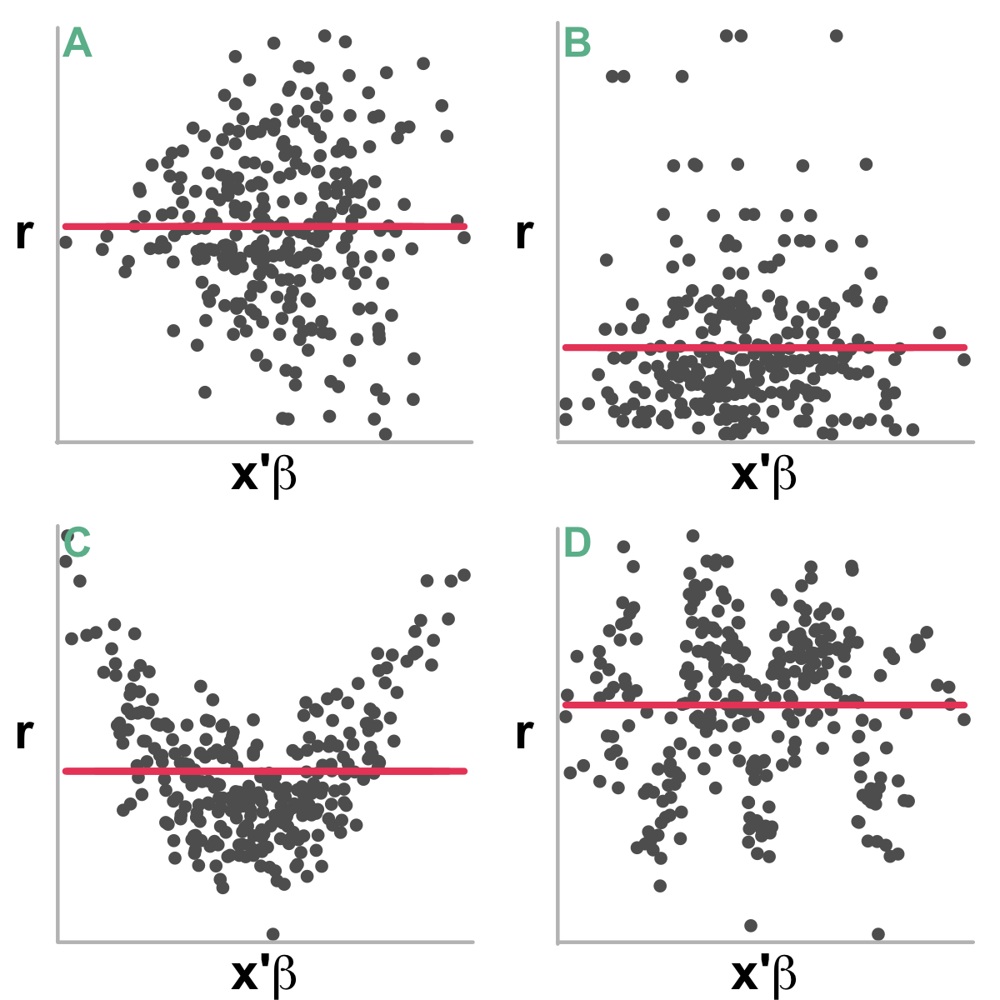
</p>

]

---

.pull-left45[

# Fehlende Prädiktoren

<br2>

<ul>
  <li class="m1"><span><high>Verletzungen der Linearitätsannahme</high> sind am gravierendsten.</span></li>
  <br>
  <li class="m2"><span><high>Fehlende Prädiktoren</high> oft verantwortlich.</span></li>
  <br>
  <li class="m3"><span>Ob <high>zusätzliche Prädiktoren</high> die Passung verbessern kann getestet werden: <mono>anova(model_1, model_2)</mono>.</span></li>
</ul>

]


.pull-right45[
<br><br>
<p align = "center">
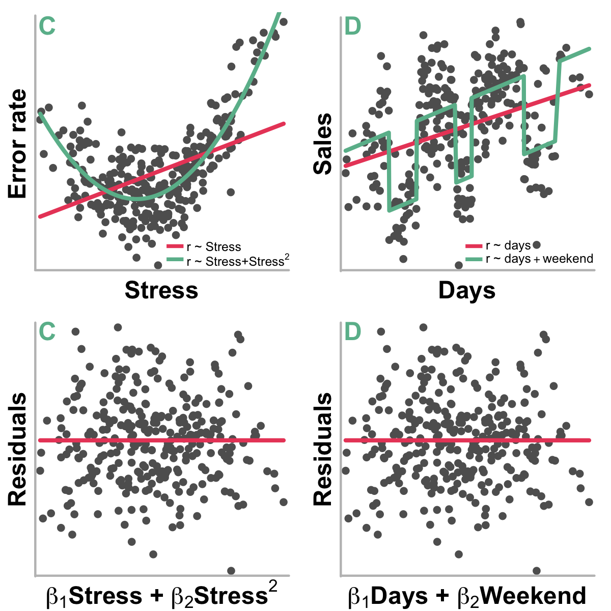
</p>


]


---

.pull-left5[

# Fehlende Prädiktoren

<ul>
  <li class="m1"><span><high>Test auf quadratischen Trend</high> in Szenario C.</span></li>
</ul>

```{r, echo = F}
n = 300
x1 = sort(rnorm(n,0,2) + runif(n,-3,3))
x2 = x1 ** 2
y = x2 + 2*x1 + rnorm(n,0,7)

x1 = scale(x1)
x2 = scale(x2)
y = scale(y)

stress_df = tibble("error_rate" = y, "stress" = x1, "stress2" = x2 )
options(width=43)
```


```{r}
# ANOVA deviance test
model_1 <- lm(error_rate ~ stress,
              data = stress_df)
model_2 <- lm(error_rate ~ stress + stress2,
              data = stress_df)
anova(model_1, model_2)
```


]


.pull-right45[
<br><br>
<p align = "center">

</p>


]

---

# Nicht-parametrische Statistik

.pull-left45[

<ul>
  <li class="m1"><span>Wenn Annahmen nicht zutreffen, kann auf nicht-parametrische Methoden zurückgegriffen werden, die höhrere <high>Robustheit</high> aufweisen</span></li>
</ul>

<table style="cellspacing:0; cellpadding:0; border:none; padding-top:10px">
  <col width="50%">
  <col width="50%">
<tr>
  <td bgcolor="white">
    <b>Ansatz</b>
  </td>
  <td bgcolor="white">
    <b>Methode</b>
  </td>  
</tr>
<tr>
  <td bgcolor="white">
    Rang-Kombinatorik
  </td>
  <td bgcolor="white">
   <mono>wilcox.test</mono>, <mono>friedman.test</mono>
  </td>  
</tr>
<tr>
  <td bgcolor="white">
    Häufigkeit-Kombinatorik
  </td>
  <td bgcolor="white">
   <mono>sign.test</mono>, <mono>chisq.test</mono>
  </td>  
</tr>
<tr>
  <td bgcolor="white">
    M-Schätzung
  </td>
  <td bgcolor="white">
    <mono>rq</mono> (quantile regr.), <mono>rfit</mono> (rank regr.)
  </td>  
</tr>
<tr>
  <td bgcolor="white">
    Bootstrap
  </td>
  <td bgcolor="white">
    <mono>boot</mono> (anything)
  </td>  
</tr>
</table>


]


.pull-right45[

<p align = "center">
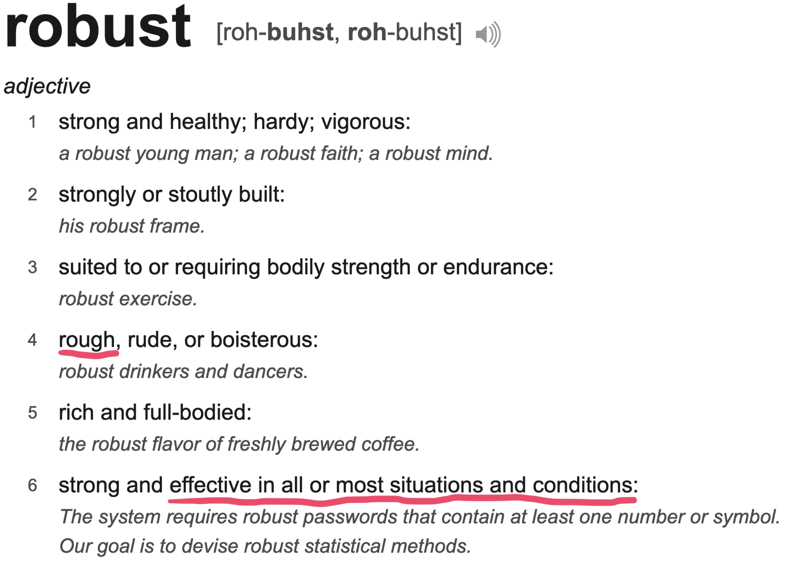
</p>

]

---

.pull-left45[

# Rangsummentest

<ul>
  <li class="m1"><span>Gruppenvergleiche können mit dem <high>Rangsummentest</high> von Wilcoxon bzw. Mann-Whitney durchgeführt werden</span></li>
  <li class="m2"><span>Der Rangsummentest testet, ob die <high>Summen gmeinsam gebildeter Ränge</high> in den Gruppen identisch sind.</span></li>
</ul>

<p align = "center">
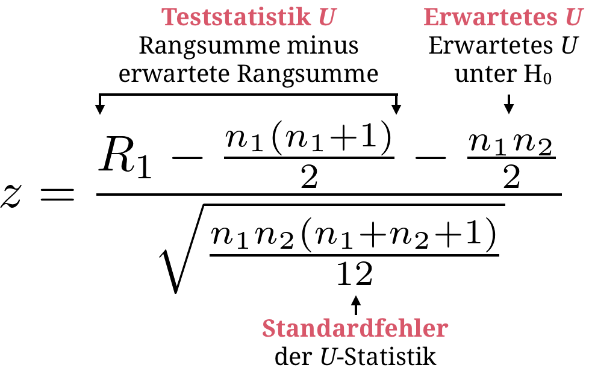
</p>


]

.pull-right45[

<br><br>
<p align = "center">
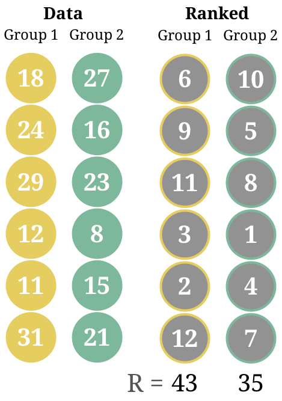
</p>


]

---

.pull-left45[

# Wilcoxon test

<ul>
  <li class="m1"><span>Gruppenvergleiche können mit dem <high>Rangsummentest</high> von Wilcoxon bzw. Mann-Whitney durchgeführt werden</span></li>
  <li class="m2"><span>Der Rangsummentest testet, ob die <high>Summen gmeinsam gebildeter Ränge</high> in den Gruppen identisch sind.</span></li>
</ul>

<p align = "center">

</p>


]


.pull-right45[

<br><br><br><br>

```{r, eval = F, echo = TRUE}
# data
group_1 <- c(18, 24, 29, 12, 11, 31)
group_2 <- c(27, 16, 23, 8, 15, 21)

# wilcoxon test
wilcox.test(group_1, group_2)

```

```{r, echo  = F}
# data
group_1 <- c(18, 24, 29, 12, 11, 31)
group_2 <- c(27, 16, 23, 8, 15, 21)

options(width=40)

# wilcoxon test
wilcox.test(group_1, group_2)

```

]


---

.pull-left45[

# Vorzeichentest

<ul>
  <li class="m1"><span>Einfacher Test für abhängige Daten basierend auf der <high>Kombinatorik von Häufigkeiten</high>.</span></li>
  <li class="m2"><span>Der Vorzeichentest testet, ob die <high>Vorzeichen von Differenzen (+,-)</high> gleich wahrscheinlich sind.</span></li>
</ul>


<p align = "center">

</p>

]

.pull-right45[

<br><br>
<p align = "center">
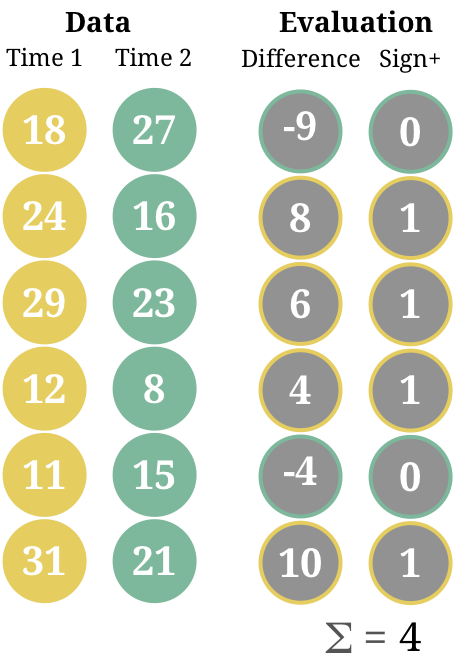
</p>


]


---

.pull-left45[

# Vorzeichentest

<ul>
  <li class="m1"><span>Einfacher Test für abhängige Daten basierend auf der <high>Kombinatorik von Häufigkeiten</high>.</span></li>
  <li class="m2"><span>Der Vorzeichentest testet, ob die <high>Vorzeichen von Differenzen (+,-)</high> gleich wahrscheinlich sind.</span></li>
</ul>


<p align = "center">

</p>


]

.pull-right45[

<br><br><br><br>

```{r, eval = F, echo = T}
# data
time_1 <- c(18, 24, 29, 12, 11, 31)
time_2 <- c(27, 16, 23, 8, 15, 21)

# sign test
N <- length(time_1)
n_plus <- sum(time_1 - time_2 > 0)
dbinom(x = n_plus : N, 
       size = N, 
       prob = .5) %>% # H0
  sum()
```

```{r, echo  =F}
options(width=40)

time_1 <- c(18, 24, 29, 12, 11, 31)
time_2 <- c(27, 16, 23, 8, 15, 21)

N <- length(time_1)
n_plus <- sum(time_1 - time_2 > 0)

# Vorzeichentest per Binomialverteilung
dbinom(x = n_plus : N, 
       size = N, 
       prob = .5) %>% 
  sum()


```
]

---

.pull-left55[

# Robuste Regression

<ul>
  <li class="m1"><span>Die Robustheit von Regression kann verbessert durch alternative Fehlerfunktionen &rho;(e) verbessert werden.</span></li>
</ul>

<p align = "center">
  
</p>


<table style="cellspacing:0; cellpadding:0; border:none; padding-top:10px">
  <col width="13%">
  <col width="13%">
  <col width="35%">
  <col width="30%">
<tr>
  <td bgcolor="white">
    <b>Funktion</b>
  </td>
  <td bgcolor="white">
    <b>Paket</b>
  </td>  
  <td bgcolor="white">
    <b>Fehlerfunktion</b>
  </td>
  <td bgcolor="white">
    <b>Beschreibung</b>
  </td>
</tr>
<tr>
  <td bgcolor="white">
    <mono>lm</mono>
  </td>
  <td bgcolor="white">
    <mono>stats</mono>
  </td>  
  <td bgcolor="white">
    
  </td>
  <td bgcolor="white">
    Kleinste-Quadrate
  </td>
</tr>
<tr>
  <td bgcolor="white">
    <mono>rq</mono>
  </td>
  <td bgcolor="white">
    <mono>quantreg</mono>
  </td>  
  <td bgcolor="white">
    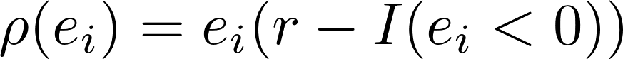
  </td>
  <td bgcolor="white">
    Quantil-Regression
  </td>
</tr>
<tr>
  <td bgcolor="white">
    <mono>rfit</mono>
  </td>
  <td bgcolor="white">
    <mono>Rfit</mono>
  </td>  
  <td bgcolor="white">
    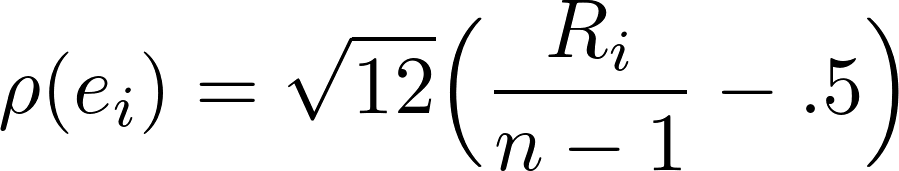
  </td>
  <td bgcolor="white">
    Rangbasierte Regression
  </td>
</tr>
</table>
]

.pull-right4[
  
  <br><br>
  <p align = "center">
  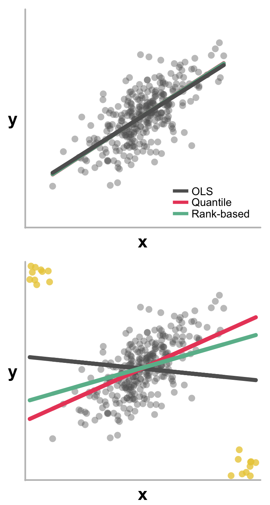
  </p>

]

---

.pull-left55[

# Robuste Regression

<ul>
  <li class="m1"><span>Die Robustheit von Regression kann verbessert durch alternative Fehlerfunktionen &rho;(e) verbessert werden.</span></li>
</ul>

<p align = "center">
  
</p>


<table style="cellspacing:0; cellpadding:0; border:none; padding-top:10px">
  <col width="13%">
  <col width="13%">
  <col width="35%">
  <col width="30%">
<tr>
  <td bgcolor="white">
    <b>Funktion</b>
  </td>
  <td bgcolor="white">
    <b>Paket</b>
  </td>  
  <td bgcolor="white">
    <b>Fehlerfunktion</b>
  </td>
  <td bgcolor="white">
    <b>Beschreibung</b>
  </td>
</tr>
<tr>
  <td bgcolor="white">
    <mono>lm</mono>
  </td>
  <td bgcolor="white">
    <mono>stats</mono>
  </td>  
  <td bgcolor="white">
    
  </td>
  <td bgcolor="white">
    Kleinste-Quadrate
  </td>
</tr>
<tr>
  <td bgcolor="white">
    <mono>rq</mono>
  </td>
  <td bgcolor="white">
    <mono>quantreg</mono>
  </td>  
  <td bgcolor="white">
    
  </td>
  <td bgcolor="white">
    Quantil-Regression
  </td>
</tr>
<tr>
  <td bgcolor="white">
    <mono>rfit</mono>
  </td>
  <td bgcolor="white">
    <mono>Rfit</mono>
  </td>  
  <td bgcolor="white">
    
  </td>
  <td bgcolor="white">
    Rangbasierte Regression
  </td>
</tr>
</table>
]

.pull-right4[

<br><br><br><br>

```{r, echo = F}

set.seed(100)

x = scale(rnorm(300,0,1))
y = scale(x + rnorm(300,0,1))

x_extra = c(runif(10,3,4),runif(10,-4,-3))
y_extra = c(runif(10,-4,-3), runif(10,3,4))

x_c = c(x, x_extra)
y_c = c(y, y_extra)

outlier_df = tibble(y = y_c, x = x_c)
options(width=35)
```

```{r, echo =T, message=F, warning=F}
# Quantile regression
library(quantreg)
m <- rq(formula = y ~ x, 
        data = outlier_df)
summary(m)

```

]


---

.pull-left55[

# Robuste Regression

<ul>
  <li class="m1"><span>Die Robustheit von Regression kann verbessert durch alternative Fehlerfunktionen &rho;(e) verbessert werden.</span></li>
</ul>

<p align = "center">
  
</p>


<table style="cellspacing:0; cellpadding:0; border:none; padding-top:10px">
  <col width="13%">
  <col width="13%">
  <col width="35%">
  <col width="30%">
<tr>
  <td bgcolor="white">
    <b>Funktion</b>
  </td>
  <td bgcolor="white">
    <b>Paket</b>
  </td>  
  <td bgcolor="white">
    <b>Fehlerfunktion</b>
  </td>
  <td bgcolor="white">
    <b>Beschreibung</b>
  </td>
</tr>
<tr>
  <td bgcolor="white">
    <mono>lm</mono>
  </td>
  <td bgcolor="white">
    <mono>stats</mono>
  </td>  
  <td bgcolor="white">
    
  </td>
  <td bgcolor="white">
    Kleinste-Quadrate
  </td>
</tr>
<tr>
  <td bgcolor="white">
    <mono>rq</mono>
  </td>
  <td bgcolor="white">
    <mono>quantreg</mono>
  </td>  
  <td bgcolor="white">
    
  </td>
  <td bgcolor="white">
    Quantil-Regression
  </td>
</tr>
<tr>
  <td bgcolor="white">
    <mono>rfit</mono>
  </td>
  <td bgcolor="white">
    <mono>Rfit</mono>
  </td>  
  <td bgcolor="white">
    
  </td>
  <td bgcolor="white">
    Rangbasierte Regression
  </td>
</tr>
</table>
]

.pull-right4[

<br><br>

```{r, echo = F}

set.seed(100)

x = scale(rnorm(300,0,1))
y = scale(x + rnorm(300,0,1))

x_extra = c(runif(10,3,4),runif(10,-4,-3))
y_extra = c(runif(10,-4,-3), runif(10,3,4))

x_c = c(x, x_extra)
y_c = c(y, y_extra)

outlier_df = tibble(y = y_c, x = x_c)
options(width=35)
```

```{r,echo=T, message=F, warning=F}
# Rank-based regression
library(Rfit)
m <- rfit(formula = y ~ x, 
          data = outlier_df)
summary(m)
```

]


---

# Bootstraptests

.pull-left45[

<ul>
  <li class="m1"><span>Bootstrap tests basieren auf wiederholten <high>Zufallsziehungen der Daten</high> (mit Zurücklegen).</span></li>
  <br>
  <li class="m2"><span>Für jedes Bootstrap sample wird die relevante Statistik berechnet, wodurch eine <high>verteilungsunabhängige, simulierte Stichprobenverteilung</high> entsteht.</span></li>
</ul>
]

.pull-right45[

  <p align = "center">
  <br>
    <font style="font-size:10px">Baron Münchhausen, from <a href="https://de.wikipedia.org/wiki/Datei:M%C3%BCnchhausen-Sumpf-Hosemann.png">wikipedia.org</a></font>
  </p>

]


---

.pull-left4[

# Bootstraptests

<b>Schritt 1</b><br>Ziehe $R$ <high>Bootstrap-Stichproben</high> $B_i$ von Grösse $n$ Beobachtungen (= eine Zeile im Datensatz). 

<b>Schritt 2</b><br><high>Berechne Statistik</high> $f(B_i)$, z.B., einen Gruppenunterschied oder ein Regressionsgewicht, für jede der $R$ Bootstrap-Stichproben. 

<b>Schritt 3</b><br><high>Evaluiere die Simulierte Statistik</high>, z.B., mit einem Konfidenzinterval.

<p align="center"></p>


]

.pull-right45[
  
  <br><br>
  <p align = "center">
  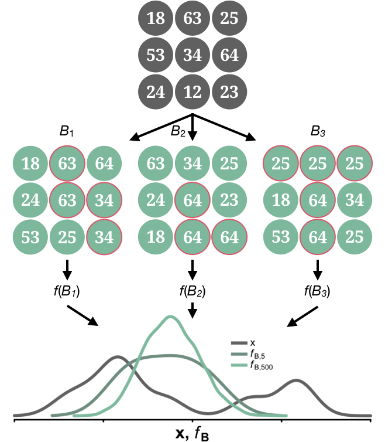
  </p>

]


---

.pull-left4[

# Bootstraptests

<b>Schritt 1</b><br>Ziehe $R$ <high>Bootstrap-Stichproben</high> $B_i$ von Grösse $n$ Beobachtungen (= eine Zeile im Datensatz). 

<b>Schritt 2</b><br><high>Berechne Statistik</high> $f(B_i)$, z.B., einen Gruppenunterschied oder ein Regressionsgewicht, für jede der $R$ Bootstrap-Stichproben. 

<b>Schritt 3</b><br><high>Evaluiere die Simulierte Statistik</high>, z.B., mit einem Konfidenzinterval.

<p align="center"></p>


]

.pull-right5[
  
<br><br><br><br>  
  
```{r, echo = F}
n = 300
x1 = sort(rnorm(n,2,2) + runif(n,-3,3))
x2 = x1 ** 2
y = x2 + 2*x1 + rnorm(n,2,7)

x1 = scale(x1,center=F)
x2 = scale(x2,center=F)
y = scale(y,center=F)

stress_df = tibble("error_rate" = y, "stress" = x1, "stress2" = x2 )
options(width=43)
```


```{r, echo = T, message=F, warning=F}
# Bootstrap
library(boot)

# bootstrap function
stat_fun <- function(data, indices){
  data <- data[indices,] # bootstrap
  m <- lm(error_rate ~ stress + stress2, 
          data = data)
  coefficients(m)
  }

# bootstrap samples
B <- boot(stress_df, 
          statistic = stat_fun, 
          R = 1000)

```

]

---

.pull-left4[

# Bootstraptests

<b>Schritt 1</b><br>Ziehe $R$ <high>Bootstrap-Stichproben</high> $B_i$ von Grösse $n$ Beobachtungen (= eine Zeile im Datensatz). 

<b>Schritt 2</b><br><high>Berechne Statistik</high> $f(B_i)$, z.B., einen Gruppenunterschied oder ein Regressionsgewicht, für jede der $R$ Bootstrap-Stichproben. 

<b>Schritt 3</b><br><high>Evaluiere die Simulierte Statistik</high>, z.B., mit einem Konfidenzinterval.

<p align="center"></p>


]

.pull-right5[

<br><br><br><br>

```{r, echo=T, message=F, warning=F}
# Bootstrap CI for stress
boot.ci(B, index = 2)
```

]

---

.pull-left4[

# Bootstraptests

<b>Schritt 1</b><br>Ziehe $R$ <high>Bootstrap-Stichproben</high> $B_i$ von Grösse $n$ Beobachtungen (= eine Zeile im Datensatz). 

<b>Schritt 2</b><br><high>Berechne Statistik</high> $f(B_i)$, z.B., einen Gruppenunterschied oder ein Regressionsgewicht, für jede der $R$ Bootstrap-Stichproben. 

<b>Schritt 3</b><br><high>Evaluiere die Simulierte Statistik</high>, z.B., mit einem Konfidenzinterval.

<p align="center"></p>


]

.pull-right5[

<br><br><br><br>

```{r, echo = T, message=F, warning=F}
# Bootstrap CI for stress2
boot.ci(B, index = 3)
```

]

---

class: middle, center

<h1><a href="https://therbootcamp.github.io/SwR_2022Apr/_sessions/RobustStats/RobustStats_practical.html">Practical</a></h1>

