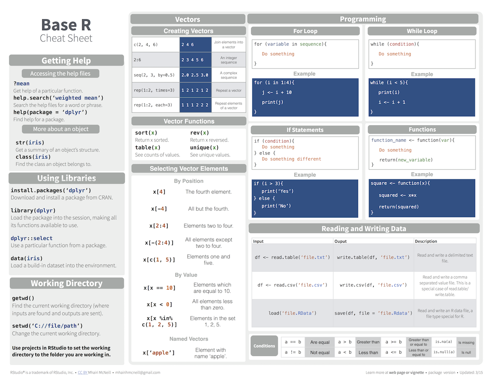

---


```{r setup, include=FALSE}
options(htmltools.dir.version = FALSE)
options(width=110)
options(digits = 4)

knitr::opts_chunk$set(fig.align = 'center')
```

<!---

.pull-left45[
<br><br><br><br><br>
#  Agenda und Materialien

Klicke auf <high>"....running..."</high> auf unserer Website!

<font style="font-size:28px"><a href="www.therbootcamp.com"><b>www.therbootcamp.com</b></a></font>

]

.pull-right5[

<br><br>
<iframe src="https://therbootcamp.github.io/SmR_2020Mai/" width="500" height="500"></iframe>

]


--->


.pull-left6[

<br><br><br>


# Aim


>### Das Ziel dieses Kurses ist Euch den kompetenten Umgang mit traditionellen und neueren Methoden der Inferenzstatistik und deren Implementierung in R zu vermitteln

]

.pull-right4[

<br><br><br><br>
<p align="center"></p>

]

---
.pull-left4[

<br>
# Agenda 

<ul>
  <li class="m1"><span><high>Workshop</high></span></li>
  <ul class="level">
    <li><span>3 Blöcke zu (Generalisierten) linearen Modellen</span></li>
    <li><span>1 Block zu gemischten, hierarchischen Modellen</span></li>
    <li><span>2 Blöcke zu praktischen Überlegungen und neuren Ansätzen</span></li>
  </ul><br>
  <li class="m2"><span><high>Block</high>
  <ul class="level">
    <li><span>Folien-basierte Einführung</span></li>
    <li><span>Viele Übungen</span></li>
    <li><span>Interaktive Zusammenfassung</span></li>
  </ul>
  </span></li>
</ul>

]

.pull-right45[
<br><br>


]


---

# Einführung

.pull-left45[
<br2>

<ul>
  <li class="m1"><span><high>Einführung</high>
  <br><br>
  <ul class="level">
    <li><span>30-45 min</span></li>
    <li><span>Konzepte & Code Beispiele</span></li>
  </ul>
  </span></li>
  <li class="m2"><span><high>Materialien</high>
  <br><br>
  <ul class="level">
    <li><span>Immer <a href="https://therbootcamp.github.io/SmR_2020Mai/">online verfügbar</a></span></li>
  </ul>
  </span></li>
</ul>

]

.pull-right55[

<p align="center">

<br>
<font style="font-size:10px">from <a href="www.Freepik.com">Freepik.com</a></font>
</p>

]


---

.pull-left45[

# Übungen


<ul>
  <li class="m1"><span><high>Selber Programmieren</high>
  <br><br>
  <ul class="level">
    <li><span>20 - 50 Aufgaben</span></li>
    <li><span>Zu Beginn einfach dann zunehmend schwieriger.</span></li>
    <li><span>Folgt Eurem eigenen Tempo.</span></li>
    <li><span>Antworten kommen später.</span></li>
  </ul>
  </span></li>
</ul>

]


.pull-right5[
<br>

  <iframe src="https://therbootcamp.github.io/SmR_2020Sep/_sessions/LinearModelsI/LinearModelsI_practical.html" height="480px" width = "500px"></iframe>

  Beispiel:<a href="https://therbootcamp.github.io/SmR_2020Sep/_sessions/LinearModelsI/LinearModelsI_practical.html"> Lineare Modelle I </a>

]

<!---

# Cheatsheets

<table width="100%" style="cellspacing:0; cellpadding:0; border:none">
  <tr>    
  <td>
  <p align = 'center'>RStudio<br><br>
  <a href="image/rstudio-ide.pdf"></a></p>
  </td>
 
  <td>
   <p align = 'center'>Base R<br><br>
  <a href="image/base-r.pdf"></a></p>
  </td>  
  
  <td> 
   <p align = 'center'>Data Import<br><br>
  <a href="image/data-import.pdf" download></a></p>
  </td>
  
  <td>
  <p align = 'center'>Data Wrangling<br><br>
  <a href="image/data-transformation.pdf"></a></p>
  </td>

  <td>
  <p align = 'center'>Data Visualization<br><br>
  <a href="image/data-visualization-2.1.pdf"></a></p>
  </td>
  

  </tr>
</table>
<br>

--->

---

# Vorstellung

.pull-left5[

<ul>
  <li class="m1"><span>Wie heisst Du?</span></li>
  <li class="m2"><span>Was ist dein Beruf?</span></li>
  <li class="m3"><span>Hast Du Programmiererfahrung mit R oder anderen Programmiersprachen?</span></li>
  <li class="m4"><span>Wieviel Erfahrung hast Du mit Statistik?</span></li>
  <li class="m5"><span>Wieso möchtest Du Statistik (mit R) lernen?</span></li>
</ul>

]

.pull-right45[

<p align="center">

<br>
<font style="font-size:10px">from <a href="www.artofmanliness.com">artofmanliness.com</a></font>
</p>

]

---
class: middle, center

<h1><a href=https://therbootcamp.github.io/SmR_2022Apr/index.html>Agenda</a></h1>
